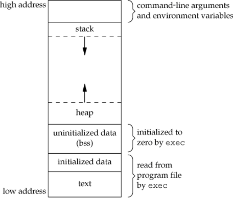

# Primitive Types

## Bitwise operations
- Left shift: `>>`
- Right shift: `<<`
- Bitwise NOT: `~`
- Bitwise AND: `&&`
- Bitwise OR: `|`
- Bitwise XOR: `^`

## Endianness
Endianness refers to the sequential order used to numerically interpret a range of bytes **in computer memory** as a larger, composed word value.
- Big-Endian: The digits are written starting from the left and to the right, with the most significant digit, 1, written first. (just like in decimal - e.g.: 123) This is analogous to the lowest address of memory being used first.
- Little-Endian: The little-endian way of writing the same number, one hundred twenty-three, would place the hundreds-digit 1 in the right-most position: 321.

## Bitwise operation on Endianness
- The bitwise operators abstract away the endianness. For example, the >> operator always shifts the bits towards the least significant digit.
- However when referring to bytes **from memory** you have to consider endianness!
```cpp
short temp = 0x1234;
temp = temp >> 8; // -> temp = 0x0012, regardless endianness
// on little endian, c will be 0x12, on big endian, it will be 0x0
char c=((char*)&temp)[0];
```

## Shifting (un)signed values
- Right shift of a negative signed number has implementation-defined behaviour.
  - Shifting right may fill "empty" bits with the original MSB (i.e. perform sign extension) or it may shift in zeros, depending on platform and/or compiler.
- A left shift, if the number either starts out negative (with 0 e.g.: 01010...), or the shift operation would shift a 1 either to or beyond the sign bit, has undefined behaviour (as do most operations on signed values which cause an overflow).
- The same operations on unsigned values are well-defined in both cases: the "empty" bits will be filled with 0.

Conclusion: Don't use shifting on singed numbers.

## Memory & memory representation of various Types
### Memory layout

- **Text Segment:** Portion of an object file or the corresponding section of the program's virtual address space that contains executable instructions is stored here. It is generally read-only and fixed size.
- **Initialized Data Segment:** contains any global or static variables which have a pre-defined value and can be modified.
- **Uninitialized segment / BSS segment:** The BSS segment contains all global variables and static variables that are initialized to zero or do not have explicit initialization in source code.
- **Heap:** Begins after the BSS and grows to larger addresses from there. Heap is the segment where dynamic memory allocation usually takes place. The heap area is shared by all threads, shared libraries, and dynamically loaded modules in a process.
- **Stack:** The stack area traditionally adjoined the heap area and grew the opposite direction. The stack area contains the program stack, a LIFO structure, typically located in the higher parts of memory. A “stack pointer” register tracks the top of the stack; it is adjusted each time a value is “pushed” onto the stack. The set of values pushed for one function call is termed a “stack frame”; A stack frame consists at minimum of a return address.

Now let's try things out live!


### Bool
Normally each boolean value takes up **1 byte**. (As they have to be addressable.)
Address  | Layout | Value
--|--|--
0xABC | 00000001 | True

## Bitwise operation tricks
- Find the right-most (1) bit: `y = x & ~(x-1)`
  - x-1 flips all bits until the right-most 1: x = 10100, x-1 = 10011.
  - Negating it results in 01100, making the numbers before the right-most 1 flip.
  - AND operation on these numbers thus yield 00100.
- Remove the right-most (1) bit: `y = x & (x-1)`
  - Subtracting 1 from the number flips the bits up to the first right-most 1, thus AND with this number sets these bits to 0.
- Set the rightmost 0 to 1: `y = x | (x+1)`
- Multiply by 2: Left shift <<
- Divide by 2: Right shift >>

# Coding challanges
1. Count the number of "1s" in the binary representation of a number.
2. Compute the party of a number. (Parity if the number of "1"s is odd, 0 otherwise.) --> Do better than the brute-force O(n)!
3. Having a 64 bit integer, swap the bits "j" and "i".
