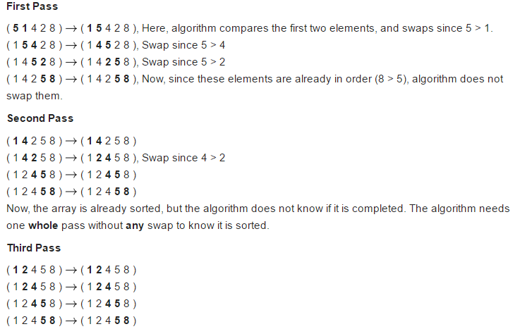
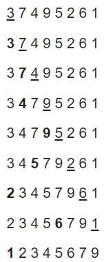
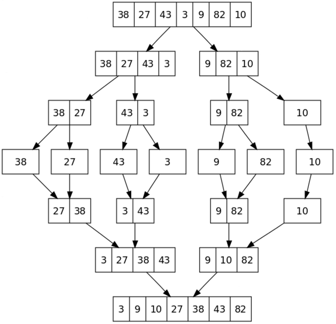
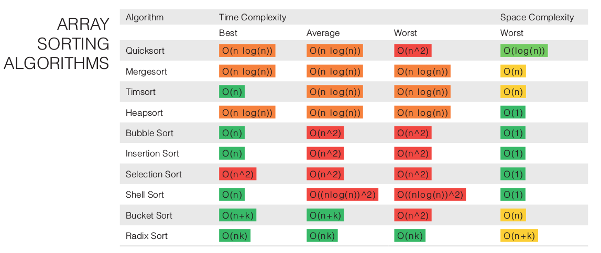

# Sorting

## Sorting in Java
**Comparable and Comparator**
- `Comparable`: A comparable object is capable of comparing itself with another object. The class itself must implement the `java.lang.Comparable` interface's `int compareTo​(T o)` method in order to be able to compare its instances. ("Compares this object with the specified object for order. Returns a negative integer, zero, or a positive integer as this object is less than, equal to, or greater than the specified object.") Returns `positive` – this object is greater than o1 `zero` – this object equals to o1
`negative` – this object is less than o1.
- `Comparator`: A comparator object is capable of comparing two different objects. The class is not comparing its own instances, but some other class’s instances. This comparator class must implement the `java.util.Comparator` interface's `compare​(T o1, T o2)` method. Returns `positive` – o1 is greater than o2 `zero` – o1 equals to o2 `negative` – o1 is less than o2. ("A comparison function, which imposes a total ordering on some collection of objects. Comparators can be passed to a sort method (such as Collections.sort or Arrays.sort) to allow precise control over the sort order.")

**Sorting with collections**
- `java.util.Collections.sort(List)` and `java.util.Arrays.sort(Object[])` methods can be used to sort using natural ordering of objects.
- `java.util.Collections.sort(List, Comparator)` and `java.util.Arrays.sort(Object[], Comparator)` methods can be used if a Comparator is available for comparison.
- **Since Java 8:** the List interface is supports the `sort` method directly, no need to use Collections.sort anymore.

**In Practice I: The class implements the Comparable interface**

```java
public class Employee implements Comparable{
    private int empId;
    private String name;
    private int age;

    /*Constructor, getters & setters*/
    public int compareTo(Employee o) {
           return this.empId - o.empId ;
    }
}

/*Now the list ob objects can be bassed to the Collections.sort()*/
Collections.sort(coll);
```

**In Practice II: Providing a Comparator**
```java
public class EmpSortByName implements Comparator<Employee>{
    public int compare(Employee o1, Employee o2) {
        return o1.getName().compareTo(o2.getName());
    }
}

/*Use instance of EmpSortByName to sort*/
Collections.sort(coll, new EmpSortByName());
```

**In Practice III: With lambda since Java 8**
```java
istDevs.sort((Employee o1, Employee o2)->o1.getAge()-o2.getAge());
```

## Stability
A sorting algorithm is said to be stable if two objects with equal keys appear in the same order in sorted output as they appear in the input array to be sorted. Some sorting algorithms are stable by nature like Insertion sort, Merge Sort, Bubble Sort, etc.


## Bubble sort
**General Info**
- Bubble sort is a simple sorting algorithm that repeatedly steps through the list to be sorted, compares each pair of adjacent items and swaps them if they are in the wrong order. The pass through the list is repeated until no swaps are needed, which indicates that the list is sorted.

**Exmaple**


**Analysis**
- Worst and average case **O(n²)**
- Best case **O(n)**

**Java Implementation**
- use `do {...} while(condition);`
- Watch out for indexes.

```java
public static int[] bubbleSort(int[] array) {
  boolean swapped;
  do {
    swapped = false;
    for (int i = 1; i < array.length; i++) {
      if (array[i] < array[i - 1]) {
        int temp = array[i];
        array[i] = array[i - 1];
        array[i - 1] = temp;
        swapped = true;
      }
    }
  } while (swapped);
  return array;
}
```

## Insertion sort
**General Info**
- Insertion sort maintains a sorted (output) part, by choosing an arbitrary element of the input sequence and taking care to insert it at the right place in the output sequence. Insertion sort iterates, consuming one input element each repetition, and growing a sorted output list. Each iteration, insertion sort removes one element from the input data, finds the location it belongs within the sorted list, and inserts it there. It repeats until no input elements remain.

**Exmaple (in-place)**



**Analysis**
- Worst case still **O(n²)**
- In-place version only **O(1)** memory.
- **Stable**

**Java Implementation**
- Effective use of labeling loops and calling continue on label.
- Note that we are using a LinkedList, that is efficient for inserting elements in the middle.

```java
public static List<Integer> insertionSort(List<Integer> numbers) {
  final LinkedList<Integer> sortedList = new LinkedList<>();

  originalList:
  for (Integer number : numbers) {
    for (int i = 0; i < sortedList.size(); i++) {
      sortedList.add(i, number);
      continue originalList;
    }
    sortedList.add(sortedList.size(), number);
  }

  return sortedList;
}
```

## Quick Sort
**General Info**
- **Pick** an element, called a **pivot**, from the array.
- **Partitioning:** reorder the array so that all elements with values less than the pivot come before the pivot, while all elements with values greater than the pivot come after it (equal values can go either way). After this partitioning, the pivot is in its final position. This is called the partition operation.
- **Recursively apply** the above steps to the sub-array of elements with smaller values and separately to the sub-array of elements with greater values.

**Example (in-place)**
- First the pivot is selected (4), and then the array is organized so that the elements right to it are greater and the elements left to it are less.
- Once done so, Quick sort is called recursively on the sub-arrays.


**Analysis**
- In efficient implementations it is **not a stable sort**, meaning that the relative order of equal sort items is not preserved. Quicksort **can operate in-place** on an array, requiring small additional amounts of memory to perform the sorting.
- Best / Average **O(n log n)**
- Worst **O(n²)**
  - The most unbalanced partition occurs when the pivot divides the list into two sublists of sizes 0 and n − 1. This may occur if the pivot happens to be the smallest or largest element in the list.
- When the number of elements is below some threshold (perhaps ten elements), switch to a non-recursive sorting algorithm such as insertion sort that performs fewer swaps, comparisons or other operations on such small arrays. The ideal 'threshold' will vary based on the details of the specific implementation.
- Quick sort is parallelizable.
- The in-place version of quicksort has a **space complexity of O(log n)**, even in the worst case.

**Java Implementation (non-inplace)**

```java
public static List<Integer> quickSort(List<Integer> list) {
  if (list.size() < 2)
    return list;

  Integer pivot = list.get(0);
  List<Integer> smaller = new ArrayList<>();
  List<Integer> larger = new ArrayList<>();

  for (int i = 1; i < list.size(); i++) {
    if (list.get(i) < pivot) {
      smaller.add(list.get(i));
    } else {
      larger.add(list.get(i));
    }
  }

  List<Integer> sorted = quickSort(smaller);
  sorted.add(pivot);
  sorted.addAll(quickSort(larger));
  return  sorted;
}
```

**Java Implementation (in-place)**
```java
public static List<Integer> quickSortInPlace(int[] array,
        int leftBoundaryIndex, int rightBoundaryIndex) {

  int pivot = array[0];
  int leftPtr = leftBoundaryIndex;
  int rightPtr = rightBoundaryIndex;

  while (leftPtr <= rightPtr) {
    while (array[leftPtr] < pivot) leftPtr++;
    while (array[rightPtr] > pivot) rightPtr--;
    if (leftPtr <= rightPtr) {
      int temp = array[leftPtr];
      array[leftPtr] = array[rightPtr];
      array[rightPtr] = temp;
      leftPtr++;
      rightPtr--;
    }
  }

  // Either conditions here, or if (l >= r) {return array;} at top
  if (leftBoundaryIndex < j) quickSort(arr, leftBoundaryIndex, j);
  if (i < rightBoundaryIndex) quickSort(arr, i, rightBoundaryIndex);
}
```

## Merge sort
**General Info**  
Merge sort is a divide and conquer algorithm that works by:
- splitting a data set until each set contains a single element.
- start merging these single, then double, then "quadra" sets.

**Example**



**Analysis**
- Time: Best / Average / Worst are **O(n log n)**
- Space: Merge sort doesn't sort in place, and memory the size of the input needs to be allocated for the sorted output to be stored in. Its space complexity, therefore, is **O(n)**

**Java Implementation**
- Divide the array until size is 1
- Then start merging the subsets. Since the subsets are sorted, you take a "pointer" to the first element of each subset and start comparing them. You put the smaller into the result array, and increment the pointer. You do this as long as one of the subsets are empty, then put the rest into the result.

```java
public static List<Integer> mergeSort(List<Integer> list) {
  if (list.size() < 2)
    return list;

  List<Integer> leftHalf = list.subList(0, list.size() / 2);
  List<Integer> rightHalf = list.subList(list.size() / 2, list.size());

  return  merge(mergeSort(leftHalf), mergeSort(rightHalf));
}

public static List<Integer> merge(List<Integer> l1, List<Integer> l2) {
  int leftPtr = 0;
  int rightPtr = 0;
  final List<Integer> merged = new ArrayList<>(left.size() + right.size());

  // Merge from both until one of them is empty
  while (leftPtr < left.size() && rightPtr < right.size()) {
    if (left.get(leftPtr) < right.get(rightPtr)) {
      merged.add(left.get(leftPtr));
      leftPtr++;
    } else {
      merged.add(right.get(rightPtr));
      rightPtr++;
    }
  }

  // Merge from the remaining part
  while (leftPtr < left.size()) {
    merged.add(left.get(leftPtr));
    leftPtr++;
  }

  while (rightPtr < right.size()) {
    merged.add(right.get(rightPtr));
    rightPtr++;
  }
  return merged;
}
```

## Final overview



## Binary Search
**General Info**  
- Binary search works on **previously sorted** arrays.
- You take the middle element, check whether this is equal to the searched element. If so you happily return `true`. Else the array is divided into two parts (greater or less than middle element), and you do this recursively with the corresponding array part.

**Analysis**
- Complexity of finding an element is **O(n log n)**

```java
public static boolean binarySearch(final List<Integer> numbers,
                                   final Integer value) {
  if (numbers == null || _numbers.isEmpty()) {
    return false;
  }

  final Integer comparison = numbers.get(numbers.size() / 2);
  if (value.equals(comparison)) {
    return true;
  }

  if (value < comparison) {
    return binarySearch(
               numbers.subList(0, numbers.size() / 2),
               value);
  } else {
    return binarySearch(
               numbers.subList(numbers.size() / 2 + 1, numbers.size()),
               value);
  }
}
```
