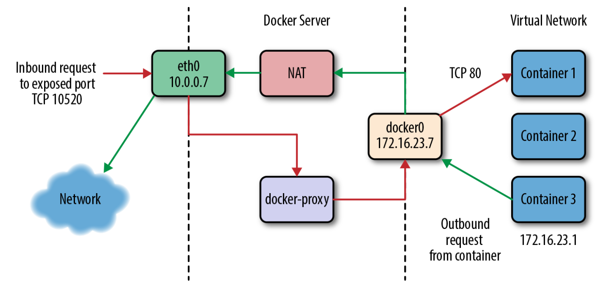
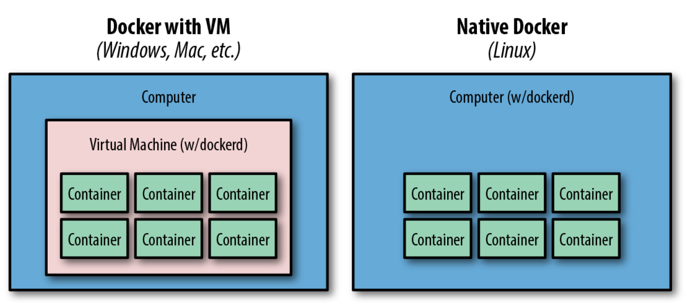

# Docker

## Introduction

- Its architectural philosophy centers on atomic or throwaway containers. During deployment, the whole running environment of the old application is thrown away with it. Nothing in the environment of the application will live longer than the application itself, and that’s a simple idea with big repercussions. It means that applications are not likely to accidentally rely on artifacts left by a previous release. And it means that applications are highly portable between servers because all of the state has to be included directly into the deployment artifact and be immutable, or sent to an external dependency like a database, cache, or file server.
- Advantages:
  - Bundling application software and required OS filesystems together in a single standardized image format
  - With Docker, you deploy your application along with every single file required to run it.
  - A container, on the other hand, is just another process that talks _directly to the Linux kernel_ and therefore can utilize more resources, up until the system or quotabased limits are reached.
  - Virtual machines contain a complete operating system, running on top of a hypervisor that is managed by the underlying host operating system. The biggest advantage to hardware virtualization is that it is easy to run many virtual machines with radically different operating systems on a single host. With containers, both the host and the containers share the same kernel. This means that containers utilize fewer system resources but must be based on the same underlying operating system (i.e., Linux).
  - Dockerfiles are used to define how a container should look at build time, but they do not manage the container’s ongoing state, and cannot be used to manage the Docker host system.
- Terminology
  - Docker client = `docker` command
  - Docker server = `dockerd` command
  - Docker images = Docker images consist of one or more filesystem layers and some important metadata that represent all the files required to run a Dockerized application. - Docker container = A Docker container is a Linux container that has been _instantiated_ from a Docker image. A specific container can exist only once; however, you can easily create multiple containers from the same image.
  - Atomic host = An atomic host is a small, finely tuned OS image, like Fedora CoreOS, that supports container hosting and atomic OS upgrades. (Traditionally, servers and virtual machines are systems that an organization will carefully assemble, configure, and maintain to provide a wide variety of functionality that supports a broad range of usage patterns.)

## The Docker Landscape

- The docker deployment process
  1. Developers build the Docker image and ship it to the registry.
  2. Operations engineers provide configuration details to the container and provision resources.
  3. Developers trigger deployment.
- Architecture
  - Standard client/server architecture where you (the client) talk over an API. Clients are responsible for telling servers what to do, and servers focus on hosting containerized applications.
  - Client/Server communication uses TCP ports 2375 for unencrypted traffic and 2376 for encrypted SSL connections.
  - The docker client (`docker`) is a Go program that compiles and runs on all common architectures and operating systems.
- Container networking
  - The default configuration is called _bridge mode_
  - On the docker host we got a virtual switch (`docker0`)
  - If you start a new container, and don't explicitly specify the network, it will join the bridge network.
  - Docker lets you bind and expose individual or groups of ports on the host to the container so that the outside world can reach your container on those ports.
  - 
- Docker on Windows/Mac vs Linux
  - To help drive this differentiation home, if you run Docker on a Mac or Windows system _you are leveraging a Linux virtual machine_ to run `dockerd`, the Docker server. However, on Linux `dockerd` _can be run natively_ and therefore there is no need for a virtual machine to be run anywhere on the system.
  - 
- Resource isolation
  - While you can put limits on their resources, the default container configuration just has them all sharing CPU and memory on the host system, much as you would expect from colocated Unix processes. This means that unless you constrain them, containers can compete for resources on your production machines. That is utterly different from a hypervisor, where the depth of process isolation usually includes running an entirely separate instance of the operating system kernel for each virtual machine.
- The docker workflow
  - Revision control
    - Filesystem layers - Docker containers are made up of stacked filesystem layers, each identified by a unique hash, where each new set of changes made during the build process is laid on top of the previous changes.
    - Image Tags - what was the previous version of the application that was deployed?
      - `latest` - since this is a floating tag, it is a really bad idea to use `latest` in most production workflows, as your dependencies can get updated out from under you, and it is impossible to roll back to `latest` because the old version is no longer the one tagged `latest`. The rule of thumb is: don’t use the `latest` tag in production.
  - Building
    - The Docker commandline tool contains a `build` flag that will consume a Dockerfile and produce a Docker image. Each command in a Dockerfile generates a new layer in the image, so it’s easy to reason about what the build is going to do by looking at the Dockerfile itself.
  - Testing
    - Since, by design, containers include all of their dependencies, tests run on containers are very reliable. If a unit test framework says tests were successful against a container image, you can be sure that you will not experience a problem with the versioning of an underlying library at deployment time, for example.
  - Deploying
    - In our experience with multiteam organizations, there are usually one or two people on each team who know the magical incantation to get deployments to work. When something goes wrong, the team is dependent on them to get it running again.

## Install and Test docker

### Getting started with Docker on Mac

- Install it yourself using the docs.
- `docker run hello-world` - should work. It prints Hello World and exists. You can see the status in `docker ps -a`. BTW you can remove it with `docker rm <imageId>`
- `docker run -d -p 80:80 --name webserver nginx` - start the webserver in detached mode, exposing its 8080 to the host's 8080 port. Now `http://localhost/` should bring up the nginx welcome page in the browser. Because we specified the default HTTP port, it isn’t necessary to append `:80` at the end of the URL. Stop it with `docker container stop webserver`, remove the container via `docker container rm webserver` and remove the image via `docker image rm nginx`
- Check out your docker settings. (Icon at the top -> preferences). See which folders do you share with containers! File sharing is required for volume mounting if the project lives outside of the `/Users` directory. Docker for Mac detects HTTP/HTTPS Proxy Settings from macOS and automatically propagates these to Docker and to your containers. When you start a container, your proxy settings propagate into the containers.

### Testing

- `docker run rm ti ubuntu:latest /bin/bash`
  - If instead you’d like Docker to automatically clean up the container and remove the file system when the container exits, you can add the `--rm` flag
  - `t` Allocate a pseudo-tty
  - `i` Keep STDIN open even if not attached
  - `ubuntu:latest` - run the ubuntu's latest tagged image
  - `/bin/bash` start the terminal
- Exploring the docker server - If you are using Docker Community Edition on a Windows or Mac, you won’t be able to easily interact with the dockerd executable, as it is intentionally hidden from the end user, but we’ll show you a trick in just a moment.

## Working with docker images

- Images are the underlying definition of what gets reconstituted into a running container, much like a virtual disk becomes a virtual machine when you start it up.
- Remember that every instruction creates a new Docker image layer, so it often makes sense to combine a few logically grouped commands onto a single line.
- The order of commands in a Dockerfile can have a very significant impact on ongoing build times. You should try to order commands so that things that change between every single build are closer to the bottom. This means that adding your code and similar steps should be held off until the end. When you rebuild an image, every single layer after the first introduced change will need to be rebuilt.
- To improve the speed of builds, Docker will use a **local cache** when it thinks it is safe. This can sometimes lead to unexpected issues because it doesn’t always notice that something changed in a lower layer. You can disable the cache for a build by using the `--no-cache` argument to the `docker build` command.

### Anathomy of a Docker file

- `FROM` - specifies your base image
- `LABEL` - A label is a key-value pair, stored as a string. You can use labels to organize your images, record licensing information, annotate relationships between containers, volumes, and networks, or in any way that makes sense for your business or application. You can see the labels applied to any image using the `docker inspect` command.
- `USER` - By default, Docker runs all processes as `root` within the container, but you can use the `USER` instruction to change this. **CAUTION** Even though containers provide some isolation from the underlying operating system, they still run on the host kernel. Due to potential security risks, production containers should almost always be run under the context of a non-privileged user.
- `ENV` instruction allows you to set shell variables that can be used by your running application for configuration and during the build process. In this case we define constants that will be used in the following `RUN` commands.
- `RUN` - each command spawns a new shell and executes the command.
  - `-y`-> Automatic yes to prompts
  - `-p` -> It will create nested directories, but only if they don't exist already.
  - Note that `apt-get update`-ing in production builds can be problematic as you might start pulling newer versions of dependencies and thus have non-reproducible builds etc.
- `ADD` instruction is used to copy files from either the local filesystem or a remote URL into your image.
- `WORKDIR` - change the working directory in the image for the remaining build instructions
- `CMD` - launch a process within the container

```dockerfile
FROM node:0.10

LABEL "maintainer"="anna@example.com"
LABEL "rating"="Five Stars" "class"="First Class"

USER root

ENV AP /data/app
ENV SCPATH /etc/supervisor/conf.d

RUN apt-get -y update

# The daemons
RUN apt-get -y install supervisor
RUN mkdir -p /var/log/supervisor

# Copy from the build-dir ../supervisord/conf.d/* to $SCPATH
ADD ./supervisord/conf.d/* $SCPATH/

# Copy from the build-dir all .js(on) files to $AP
ADD *.js* $AP/

WORKDIR $AP

# Install npm dependencies for the app
RUN npm install

CMD ["supervisord", "-n"]
```

### Building an Image

- For this tutorial clone the following repo: `https://github.com/spkane/docker-node-hello.git`, which contains the dockerfile above.
- The `.dockerignore` file allows you to define files and directories that you do not want uploaded to the Docker host when you are building the image. E.g. `.git`
- Build with `docker build -t example/dockernodehello:latest --no-cache .`

### Debugging an image

- Lets change the `apt-get update` a bit and build the image. This will produce the following error:

```txt
Step 6/14 : ENV SCPATH /etc/supervisor/conf.d
---> Running in 9c0a385269cf
Removing intermediate container 9c0a385269cf
---> 8a773166616c
Step 7/14 : RUN apt-get -y update-all
---> Running in cd57fc47503d
E: Command line option 'y' [from y] is not known.
The command '/bin/sh c apt-get -y update-all' returned a nonzero code: 100
```

- `Running in 9c0a385269cf` is telling you that the build process has
  started a new container, based on the image created in step 5.
- `Removing intermediate container 9c0a385269cf`, is telling you that Docker is now removing the container, after having altered it based on the instruction in step 6.
- `---> 8a773166616c`, is the one we really care about, because this is giving us the image ID for the image that was generated by step 6.
- With this information, it is possible to run an interactive ontainer so that you can try to determine why your build is not working properly. `docker run --rm -ti 8a773166616c /bin/bash` Now you can go into the shell and find out there is no such thing as `update-all`, hence use `apt-get -y update`.

### Running the image

- `docker run -d -p 8080:8080 example/dockernodehello:latest`
  - `-d` run in detached mode
  - `-p` Publish a container's port or a range of ports to the host
- See if it is running with `docker ps`
- You can usually determine the Docker host IP address by simply printing out the value of the `DOCKER_HOST` environment variable unless you are only running Docker locally, in which case 127.0.0.1 should work. Docker Machine users can also simply use `docker-machine ip`. --> `echo $DOCKER_HOST`. If you are running Docker CE locally, you may not have \$DOCKER_HOST set and can just assume localhost or 127.0.0.1.
  - **WARNING** If your working with docker-machine as it is still the case with Win 10 home & Mac, you won't have your application on localhost but at the IP of the docker-machine VM.
    - `docker-machine ls` to list the machines. If there are none, create one!
    - `docker-machine create --driver virtualbox default`
    - Now list the machine properties: `docker-machine env default`
  - **WARNING** - You cannot access container IPs directly on mac.
    - There is no `docker0` bridge on macOS - Because of the way networking is implemented in Docker for Mac, you cannot see a `docker0` interface on the host. This interface is actually within the virtual machine.
    - Docker for Mac can’t route traffic to containers.
  - The nginx worked this crap does not... IMO it's the image's fault. NVM...
- `- docker run -d -e WHO="Sean and Karl" -p 8080:8080 example/dockernodehello:latest` - Using the `-e` flag you can inject environment variables.

### Storing images

- Public registries
  - **Login & Logout**
    - If you have images that can be published to the internet, the best place for them is a public registry, like Docker Hub.
    - Create an account on docker hub.
    - Use `docker login` to log in to the repository. But what happened under the covers? It turns out that Docker has written a dotfile for us in our home directory to cache this information. -> `ls -la ~/.docker/config.json && cat ~/.docker/config.json`
    - As with logging in, you can also log out of a registry if you no longer want to cache the credentials -> `docker logout`
    - To log in something else than the default docker hub: `docker login someregistry.example.com`
  - **Push to registry**
    - Since we want to push it to the real repository we need to edit the previously added `example/dockernodehello` tag. When running locally the repository (example) can be anything but now it has to match the real repository.
    - `docker tag example/dockernodehello:latest ${<myuser>}/dockernodehello:latest`
    - `docker push ${<myuser>}/dockernodehello:latest`
    - `docker pull ${<myuser>}/dockernodehello:latest` - to see if we can pull it
- Private registries
  - Like your gitlab... 

### Advanced Building tips

- 
