# Intro to Kubernetes

## Introduction

- We would like to have a fault-tolerant and scalable solution, which can be achieved by creating a single controller/management unit, after connecting multiple nodes together. This controller/management unit is generally referred to as a container orchestrator.
- **Containers** are an application-centric way to deliver high-performing, scalable applications on the infrastructure of your choice.
- With a **container image**, we bundle the application along with its runtime and dependencies. We use that image to create an isolated executable environment, also known as container.
- In production we want (to be)
  - fault tolerant
  - scalable on demand
  - update/rollback without downtime
  - use resources optimally
- **Container orchestrators** are the tools which group hosts together to form a cluster, and help us fulfill the requirements mentioned above.
  - Implementations: Docker Swarm, Kubernetes, Apache Mesos, Amazon ECS...
  - Capabilities:
    - Bring multiple hosts together and make them part of a cluster
    - Schedule start/stop containers

## Kubernetes

- Features:

  - Automatic binpacking (=scheduling)
  - Self-healing
  - Horizontal scaling
  - Service discovery and Load balancing -> Kubernetes groups sets of containers and refers to them via a **Domain Name System (DNS)**. This DNS is also called a Kubernetes service. Kubernetes can discover these services automatically, and load-balance requests between containers of a given service.
  - Automated rollouts and rollbacks
  - Secrets and configuration management
  - Storage orchestration
  - Batch execution

- Architecture

  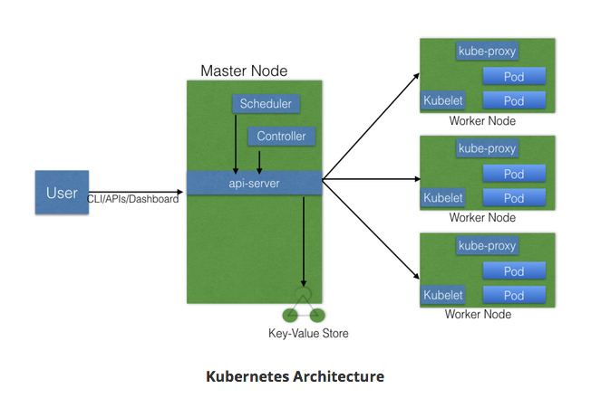

  - One or more **master nodes**
    - **Tasks**:
      - Managing the cluster
      - Entry point for administrative tasks. (Communication via CLI (`kubectl`), GUI, API)
      - If there are more master nodes only one of them is the leader.
    - **Processes**:
      - `kube-apiserver`: Validates and configures data for the api objects which include pods, services, replication-controllers. Resulting state stored in `etcd`!)
      - `kube-scheduler`: Watches newly created pods that have no node assigned, and selects a node for them to run on. (Lot of factors taken into while scheduling such as resource requirements, HW/SW/policy constraints etc.)
      - `kube-controller-manager`: Runs controllers. Logically, each controller is a separate process, but to reduce complexity, they are all compiled into a single binary and run in a single process. Such controllers include:
        - Node Controller: noticing when nodes go down
        - Replication Controller: maintaining correct number of pods
        - Endpoints Controller: Populates endpoints object (joins Services and Pods)
        - Service Account & Token Controllers: Create default accounts and API access tokens for new namespaces
      - `etcd`: Consistent and highly-available key value store used as Kubernetes’ backing store for all cluster data. Always have a backup! - The key-value store can be part of the master node. It can also be configured externally, in which case, the master nodes would connect to it. Works in Raft Consensus Algorithm -> _Failsafe_.
  - One or more **worker nodes**
    - **Tasks**
      - Runs apps using **Pods**.
        - A Pod is a scheduling unit in Kubernetes.
        - It is a logical collection of one or more containers which are _always scheduled together_.
    - **Components**:
      - `Container runtime`
        - To run and manage a container's lifecycle, we need a container runtime on the worker node. Examples: `containerd`, `rkt`, `lxd`.
        - Note: Docker is a platform which uses `containerd` as a container runtime.
      - `kublet`
        - Agent which runs on each worker node and communicates with the master node. Also supervises the healthiness of the pods.
        - The kubelet connects to the container runtime using **Container Runtime Interface (CRI).** This is a plugin interface which enables `kubelet` to use a wide variety of container runtimes (rktnetes, Docker etc.) Hence you can develop your own container runtime.
          - CRI protocol buffer includes two services:
            - `ImageService`: provides RPCs to pull an image from a repository, inspect, and remove an image.
            - `RuntimeService`: contains RPCs to manage the lifecycle of the pods and containers, as well as calls to interact with containers
        - CRI shims:
          - **dockershim**: containers are created using Docker installed on the worker nodes (which uses `containerd`)
          - **cri-containerd**: directly use `containerd`
            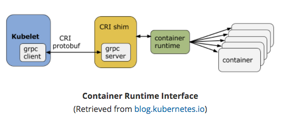
      - `kube-proxy`
        - Enables the Kubernetes service abstraction by maintaining network rules on the host and performing connection forwarding.
          -It is a network proxy which runs on each worker node and listens to the API server for each Service endpoint creation/deletion. For each Service endpoint, kube-proxy sets up the routes so that it can reach to it. -> helps to expose your service.

- Cluster Networking
  - The Docker version
    - Creates a virtual bridge (`docker0`) and allocates a subnet from one of the private address blocks for that bridge.
    - For each container that Docker creates, it allocates a virtual Ethernet device (called `veth`) which is attached to the bridge.
    - The `veth` is mapped to appear as `eth0` in the container, using Linux namespaces. The in-container `eth0` interface is given an IP address from the bridge’s address range.
    - The result is that Docker containers **can talk to other containers only if they are on the same machine -> same virtual bridge**. In order for Docker containers to communicate across nodes, there must be allocated ports on the machine’s own IP address, which are then forwarded or proxied to the containers.
      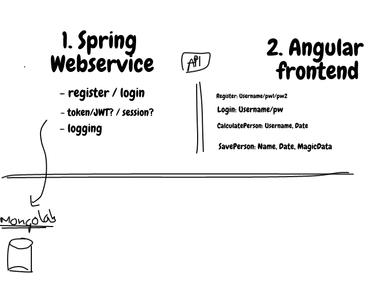
    - Docker can start a container and rather than creating a new virtual network interface for it, specify that it shares an existing interface. In this case the drawing above looks a little different:
      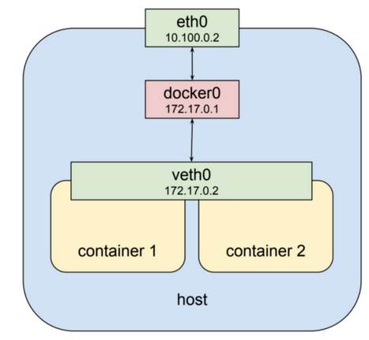
      - Both containers are addressable from the outside on 172.17.0.2
      - On the inside each can hit ports opened by the other on localhost
  - The Kubernetes version
    - Kubernetes imposes the following fundamental requirements on any networking implementation:
      - all containers can communicate with all other containers without NAT
      - all nodes can communicate with all containers (and vice-versa) without NAT
      - the IP that a container sees itself as is the same IP that others see it as
    - What this means in practice is that **you can not just take two computers running Docker and expect Kubernetes to work**. You must **ensure that the fundamental requirements** are met.
    - Kubernetes applies **IP addresses at the Pod scope** - containers within a Pod share their network namespaces - including their IP address. This means that containers within a **Pod** can all reach each other’s ports on **localhost**. -> Containers within a Pod **must coordinate port usage**, but this is no different than processes in a VM.
    - Kubernetes does something like the second example of docker networking: it creates a special container for each pod whose only purpose is to provide a network interface for the other containers.
      - `docker ps` and you will see at least one container that was started with the `pause` command
      - Despite this lack of activity the “pause” container is the heart of the pod, providing the virtual network interface that all the other containers will use to communicate with each other and the outside world.
        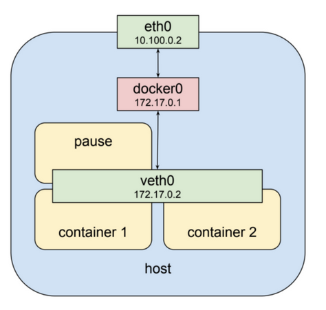
    - Let's step out and see how this looks like on a cluster with multiple nodes. One node typically has no idea what private address space was assigned to a bridge on another node, and we need to know that if we’re going to send packets to it and have them arrive at the right place.
      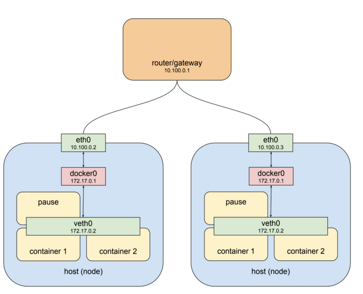
    - Kubernetes comes to the help! It assigns an overall address space for the bridges on each node, and then assigns the bridges addresses within that space, based on the node the bridge is built on. It also adds routing rules to the gateway at 10.100.0.1 telling it how packets destined for each bridge should be routed, i.e. which node’s eth0 the bridge can be reached through.
      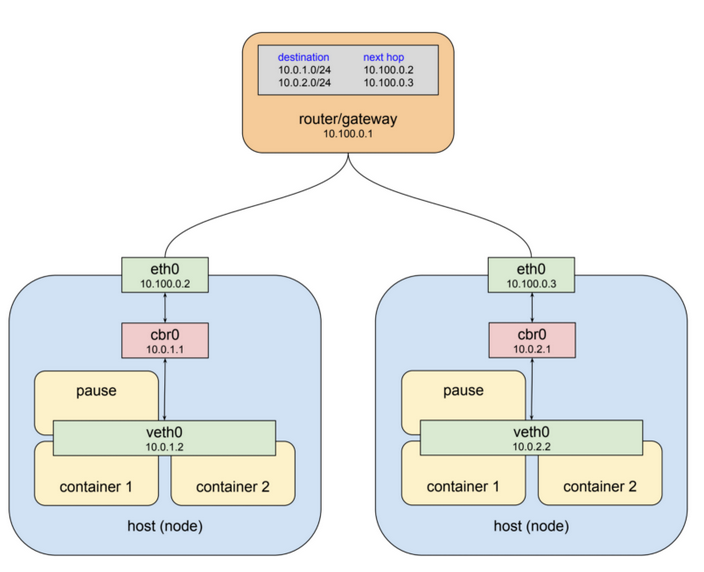
      - Kubernetes does not use the standard docker bridge device and in fact “cbr” is short for “custom bridge.”

## Installing K8s

- Configurations
  - **All-in-One Single-Node Installation**
    - Master and worker components are installed on a single node. -> Learning, Development, Testing. **Don't** use this in production. Minikube is an example.
  - **Single-Node etcd, Single-Master, and Multi-Worker Installation**
    - Single master node, which also runs a single-node etcd instance. Multiple worker nodes are connected to the master node.
  - **Single-Node etcd, Multi-Master, and Multi-Worker Installation**
    - Multiple master nodes, which work in an HA mode, but we have a single-node etcd instance. Multiple worker nodes are connected to the master nodes.
  - **Multi-Node etcd, Multi-Master, and Multi-Worker Installation**
    - Etcd is configured in a clustered mode, outside the Kubernetes cluster, and the nodes connect to it. The master nodes are all configured in an HA mode, connecting to multiple worker nodes. This is the most advanced and _recommended production setup._
- Installations
  - Localhost: Minikube, Ubuntu on LXD
  - On premise:
    - VMs: Kubernetes can be installed on VMs created via Vagrant, VMware vSphere, KVM, etc.
    - Bare Metal: On top of different operating systems, like RHEL, CoreOS, CentOS, Fedora, Ubuntu, etc.
  - Hosted solutions: GKE, AKS, EKS, etc.
- Tools/Resources
  - kubeadm, KubeSpray, Kops

## Setting Up a Single-Node Cluster with Minikube

- Install `kubectl`. (Binary used to access any Kubernetes cluster).
  - `brew install kubernetes-cli`
- Install `minikube`
  - `brew cask install minikube`
- Start minikube
  - `minikube start`
    - If hangs for more than 3-5 min do `minikube delete` to delete the current cluster.
    - In case of errors:
      - `$minikube stop`
      - `$minikube delete && rm -rf ~/.minikube && rm -rf ~/.kube`
      - `$minikube start --vm-driver=hyperkit --bootstrapper=localkube`
  - `minikube status`
  - `minikube stop`
- Accessing minikube
  - `kubectl` is the Command Line Interface (CLI) tool to manage the Kubernetes cluster resources and applications.
  - The Kubernetes dashboard provides the Graphical User Interface (GUI) to interact with its resources and containerized applications.
  - API
    - **Core Group (/api/v1)**
      - This group includes objects such as Pods, Services, nodes, etc.
    - **Named Group**
      - This group includes objects in `/apis/$NAME/$VERSION` format.
    - **System-wide**
      - This group consists of system-wide API endpoints, like `/healthz`, `/logs`, `/metrics`, `/ui`, etc.
  - Connecting to a node:
    - To connect to the Kubernetes cluster, kubectl needs the **master node endpoint** and the **credentials** to connect to it.
    - When starting Minikube it creates these be default. These are at `~/.kube/config`. You can also view them via `kubectl config view`.
    - Once the cluster is running get info of it: `kubectl cluster-info` -> "Kubernetes master is running at https://192.168.99.100:8443"
    - You can also use the dashboard (once minikube is running): `minikube dashboard` -> opens a new tab on our web browser. (Wait 1 min...). Also `kubectl proxy` command, `kubectl` would authenticate with the API server on the master node and would make the dashboard available on `http://127.0.0.1:8001/api/v1/namespaces/kube-system/services/kubernetes-dashboard:/proxy/#!/overview?namespace=default`
    - When started with `kubectl proxy` you can curl for the api: `curl http://localhost:8001/`
    - **Without `kubectl proxy` configured**, we can get the **Bearer Token** using `kubectl`, and then send it with the API request. A Bearer Token is an access token which is generated by the authentication server (the API server on the master node) and given back to the client. Using that token, the client can connect back to the Kubernetes API server without providing further authentication details, and then, access resources.
      - To get the token: `TOKEN=$(kubectl describe secret -n kube-system $(kubectl get secrets -n kube-system | grep default | cut -f1 -d ' ') | grep -E '^token' | cut -f2 -d':' | tr -d '\t' | tr -d " ")`
      - `APISERVER=$(kubectl config view | grep https | cut -f 2- -d ":" | tr -d " ")`
      - Check the correct value of APISERVER: `echo $APISERVER`. If there are multiple entries copy the `https://192.168.99.100:8443`.
      - `curl $APISERVER --header "Authorization: Bearer $TOKEN" --insecure`

## Kubernetes Objects

- YML configuration file

  - Declare our intent or desired state using the `spec` field, while the `status` field will hold the actual state. Kubernetes Control Plane tries to match the object's actual state to the object's desired state.
  - Most often, we provide an object's definition in a.yaml file, which is converted by kubectl in a JSON payload and sent to the API server. Example:

  ```yml
  apiVersion: apps/v1 # API endpoint on the API server which we want to connect to
  kind: Deployment # object type - in our case, we have Deployment
  metadata: # basic information to objects, like the name
    name: nginx-deployment
    labels:
      app: nginx
  spec: # desired state of the deployment
    replicas: 3 # at least 3 Pods are running, created by spec.template
    selector:
      matchLabels:
        app: nginx
    template:
      metadata:
        labels:
          app: nginx
      spec: # define the desired state of the Pod.
        containers:
          - name: nginx
            image: nginx:1.7.9 # image to be used for pod
            ports:
              - containerPort: 80
  ```

  - Once the object is created, the Kubernetes system attaches the status field to the object; we will explore it later.

- **Pod**
  - Unit of deployment in Kubernetes, which represents a single instance of the application. A Pod is a logical collection of one or more containers, which:
    - Are scheduled together on the same host
    - Share the same network namespace (i.e. see each other on localhost)
    - Mount the same external storage (volumes).
  - We don't deploy a Pod independently, as it would not be able to re-start itself, if something goes wrong. (Deploy it with replication controllers.)
    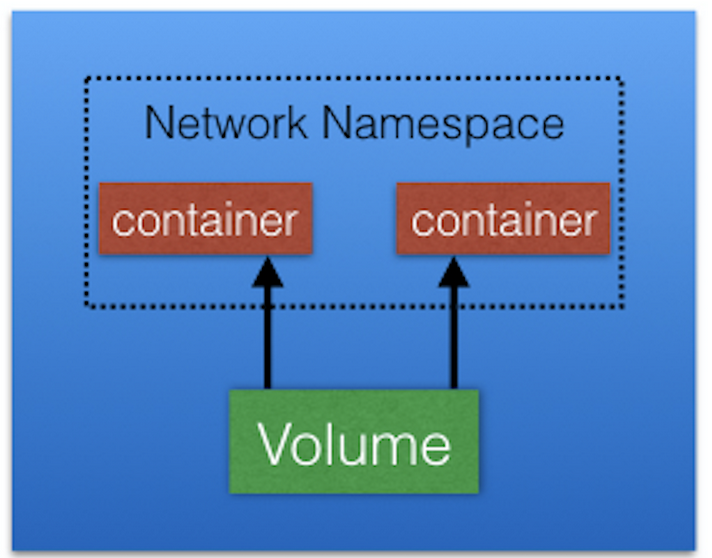
- **Labels**
  - Key-value pairs that can be attached to any Kubernetes objects. Used to organize and select a subset of objects.
  - e.g.: Pod1: `app: frontend`, Pod2: `app: backend` -> same label with two different values on the different pods.
  - Equality-Based Label Selectors: `=, ==, !=` operators. e.g.: `app==frontend`
  - Set-Based Selectors: Filtering of objects based on a set of values. `in notin exist` operators.
    - e.g.: `env in (dev,qa)`
- **Replication Controllers**
  - Part of the master node's controller manager.
  - It makes sure the specified number of replicas for a Pod is running at any given point in time. (starts new pods if necessary, kills of if pod is not required anymore)
- **Replica Sets**
  - A `ReplicaSet` (rs) is the next-generation `ReplicationController`. `ReplicaSets` support both equality- and set-based selectors, whereas `ReplicationControllers` only support equality-based Selectors. Currently, this is the only difference.
  - `ReplicaSets` can be used independently, but they are mostly used by `Deployments` to orchestrate the Pod creation, deletion, and updates. A Deployment automatically creates the `ReplicaSets`, and we do not have to worry about managing them.
- **Deployments**
  - Deployment objects provide declarative updates to Pods and `ReplicaSets`. The `DeploymentController` is part of the master node's controller manager, and it makes sure that the current state always matches the desired state.
  - **Deployment rollout**
    - In the following example, we have a `Deployment` which creates a `ReplicaSet A`. `ReplicaSet A` then creates 3 Pods. In each Pod, one of the containers uses the `nginx:1.7.9` image.
    - Now, in the Deployment, we change the Pods Template and we update the image for the nginx container from `nginx:1.7.9` to `nginx:1.9.1`. As have modified the Pods Template, a new `ReplicaSet B` gets created.
    - **A rollout is only triggered when we update the Pods Template for a deployment**. Operations like scaling the deployment do not trigger the deployment. Once ReplicaSet B is ready, the Deployment starts pointing to it.
      
    - On top of `ReplicaSets`, `Deployments` provide features like Deployment recording, with which, if something goes wrong, we can rollback to a previously known state.
- **Namespaces**
  - If we have numerous users whom we would like to organize into teams/projects, we can partition the Kubernetes cluster into sub-clusters using `Namespaces`. The names of the resources/objects created inside a `Namespace` are unique, but not across `Namespaces`.
  - `kubectl get namespaces` to list all namespaces.
  - Two + 1 default Namespaces:
    - `kube-system`: contains the objects created by the Kubernetes system
    - `default`: contains the objects which belong to any other Namespace
    - `kube-public` is a special Namespace, which is readable by all users and used for special purposes, like bootstrapping a cluster.
  - By default, we connect to the default.

## Authentication, Authorization

- **Authentication**: Logs in a user
  - **Normal Users**: managed outside of the Kubernetes cluster via independent services like User/Client Certificates, a file listing usernames/passwords, Google accounts, etc.
  - **Service Accounts**: With Service Account users, in-cluster processes communicate with the API server to perform different operations.
  - If properly configured, Kubernetes can also support **anonymous requests**, along with requests from Normal Users and Service Accounts.
  - There are many different authentication mechanisms available, such as: Client Certificates, Static Token File, Service Account Tokens, OpenID Connect Tokens, Keystone Passwords etc.
- **Authorization**: Authorizes the API requests added by the logged-in user.

  - Some of the API request attributes that are reviewed by Kubernetes include user, group, extra, Resource or Namespace, to name a few. Next, these attributes are evaluated against policies. If the evaluation is successful, then the request will be allowed, otherwise it will get denied.
  - Many authorizers are supported: Node Authorizer, Attribute-Based Access Control (ABAC) Authorizer, Webhook Authorizer

    - Role-Based Access Control (RBAC) Authorizer:

      - regulate the access to resources based on the roles of individual users
      - While creating the roles, we restrict resource access by specific operations, such as `create, get, update, patch`, etc.

        - **Role**: With Role, we can grant access to resources within a specific Namespace.

          ```yml
          kind: Role
          apiVersion: rbac.authorization.k8s.io/v1
          metadata:
          namespace: lfs158 # ccess only to the Pods of lfs158 Namespace
          name: pod-reader
          rules:
            - apiGroups: [""] # "" indicates the core API group
          resources: ["pods"]
          verbs: ["get", "watch", "list"]
          ```

        - **Cluster Role**: grant the same permissions as Role does, but its _scope is cluster-wide_.

    - We have 2 ways to bind users to roles:
      - **RoleBinding**: bind users to the same namespace as a Role
      - **ClusterRoleBinding**: grant access to resources at a cluster-level and to _all_ Namespaces
        ```yml
        kind: RoleBinding
        apiVersion: rbac.authorization.k8s.io/v1
        metadata:
          name: pod-read-access
          namespace: lfs158
        subjects:
          - kind: User
            name: nkhare # gives access to nkhare to read the Pods of lfs158 Namespace
            apiGroup: rbac.authorization.k8s.io
        roleRef:
          kind: Role
          name: pod-reader
          apiGroup: rbac.authorization.k8s.io
        ```
        - To enable the RBAC authorizer, we would need to start the API server with the `--authorization-mode=RBAC`

- **Admission Control**: software modules that can modify or reject the requests based on some additional checks, like Quota.
  - To use admission controls, we must start the Kubernetes API server with the admission-control, which takes a comma-delimited, ordered list of controller names:
    - `--admission-control=NamespaceLifecycle,ResourceQuota,PodSecurityPolicy,DefaultStorageClass`
  - By default, Kubernetes comes with some built-in admission controllers.

```sh
Practice:

$: minikube start --extra-config=controller-manager.ClusterSigningCertFile="/var/lib/localkube/certs/ca.crt" --extra-config=controller-manager.ClusterSigningKeyFile="/var/lib/localkube/certs/ca.key" --extra-config=apiserver.Authorization.Mode=RBAC
$: kubectl config view
-> See that current-context is minikube, we are connecting user "minikube" to cluster "minikube"
$: kubectl create namespce lfs158
$: mkdir ~/rbac
$: cd ~/rbac
$: openssl genrsa -out nkhare.key 2048
-> created private key
$: openssl req -new -key nkhare.key -out nkhare.csr -subj "/CN=nkhare/O=cloudyuha"\n
-> generate signing request
// TODO...
```

## Services

- **Intro**

  - In a "dummy" scenario users could connect to Pods by the Pod's IP address. However once a Pod dies and a new pod is started using a different IP, the user wouldn't be able to reach the newly created pod. -> Kubernetes provides a higher-level abstraction called Service, which logically groups Pods and a policy to access them.
  - Previously we have talked about labels and selectors. We can assign a **name** to the logical grouping, referred to as a **Service name**. In our example, we can create two Services, `frontend-svc` (app==frontend) and the `db-svc` (app==db) using selectors. Now the user can reach the actual pods using the services and hence using the selectors.
    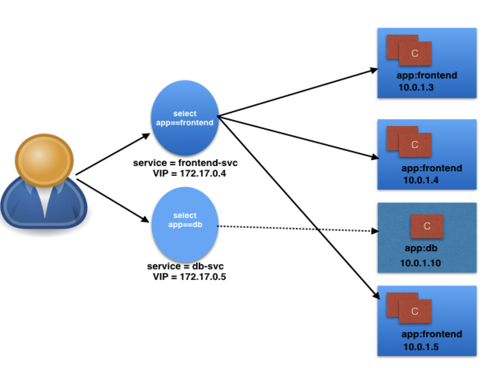
  - The user/client now connects to a service via the IP address, which forwards the traffic to one of the Pods attached to it. A service does the load balancing while selecting the Pods for forwarding the data/traffic.

    ```yml
    kind: Service
    apiVersion: v1
    metadata:
      name: frontend-svc
    spec:
      selector:
        app: frontend
      ports:
        - protocol: TCP
          port: 80
          targetPort: 5000
    ```

    - In our example, for `frontend-svc`, we will receive requests from the user/client on Port `80`. We will then forward these requests to one of the attached Pods on Port `5000`. If the target port is not defined explicitly, then traffic will be forwarded to Pods on the port on which the Service receives traffic.
    - In our case, frontend-svc has 3 endpoints: `10.0.1.3:5000, 10.0.1.4:5000`, and `10.0.1.5:5000`.

- **Kube-Proxy**
  - All of the worker nodes run a daemon called kube-proxy, which watches the API server on the master node for the addition and removal of Services and endpoints. For each new Service, on each node, kube-proxy configures the iptables rules to capture the traffic for its ClusterIP and forwards it to one of the endpoints. When the service is removed, kube-proxy removes the iptables rules on all nodes as well.
    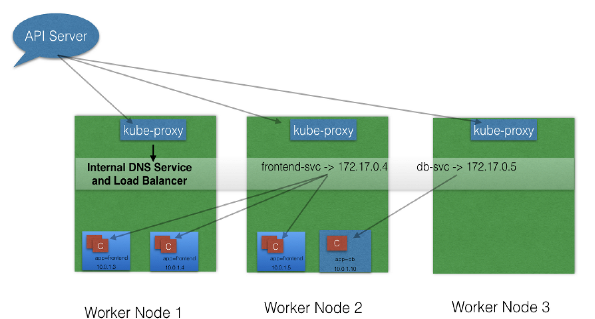
- **Service Discovery**

  - **Environment Variables**
    - As soon as the Pod starts on any worker node, the `kubelet` daemon running on that node adds a set of environment variables in the Pod for all active Services. For example, if we have an active Service called `redis-master`, which exposes port `6379`, and its ClusterIP is `172.17.0.6`, then, on a newly created Pod, we can see the following environment variables:
      ```yml
      REDIS_MASTER_SERVICE_HOST=172.17.0.6
      REDIS_MASTER_SERVICE_PORT=6379
      REDIS_MASTER_PORT=tcp://172.17.0.6:6379
      REDIS_MASTER_PORT_6379_TCP=tcp://172.17.0.6:6379
      REDIS_MASTER_PORT_6379_TCP_PROTO=tcp
      REDIS_MASTER_PORT_6379_TCP_PORT=6379
      REDIS_MASTER_PORT_6379_TCP_ADDR=172.17.0.6
      ```
  - **DNS**
    - Kubernetes has an add-on for DNS, which creates a DNS record for each Service and its format is like `my-svc.my-namespace.svc.cluster.local`
    - This is the most common and highly recommended solution. For example, in the previous section's image, we have seen that an internal DNS is configured, which maps our Services `frontend-svc` and `db-svc` to `172.17.0.4` and `172.17.0.5`, respectively.

- **ServiceType (Scope)**
  - **ClusterIP**
    - Default ServiceType. A Service gets its Virtual IP address using the ClusterIP. That IP address is used for communicating with the Service and is accessible only within the cluster.
  - **NodePort**
    - In addition to creating a ClusterIP, a port from the range 30000-32767 is mapped to the respective Service, from all the worker nodes. For example, if the mapped NodePort is `32233` for the service f`rontend-svc`, then, if we connect to any worker node on port `32233`, the node would redirect all the traffic to the assigned ClusterIP - 172.17.0.4.
      
    - The NodePort ServiceType is useful when we want to make our Services accessible from the external world. The end-user connects to the worker nodes on the specified port, which forwards the traffic to the applications running inside the cluster.
  - **LoadBalancer**
    - NodePort and ClusterIP Services are automatically created, and the external load balancer will route to them
    - The Services are exposed at a static port on each worker node
    - The Service is exposed externally using the underlying cloud provider's load balancer feature.
    - (Same image as before, except node-balancer stands between service and user. The user communicates with the load balancer.)
  - **ExternalIP**
    - A Service can be mapped to an ExternalIP address if it can route to one or more of the worker nodes. Traffic that is ingressed into the cluster with the ExternalIP (as destination IP) on the Service port, gets routed to one of the the Service endpoints.
      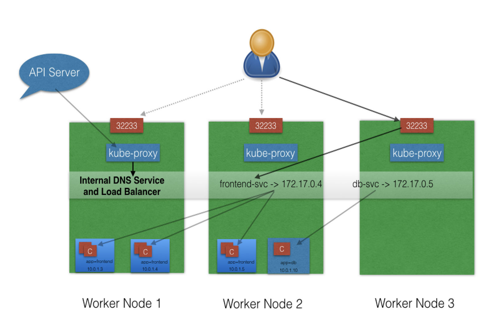
    - Please note that ExternalIPs are not managed by Kubernetes. The cluster administrators has configured the routing to map the ExternalIP address to one of the nodes.
  - **ExternalName**
    - no Selectors and does not define any endpoints. When accessed within the cluster, it returns a `CNAME` record of an externally configured Service.
    - The primary use case of this ServiceType is to make externally configured Services like `my-database.example.com` available inside the cluster, using just the name, like `my-database`, to other Services inside the same Namespace.

## Deploying the Stuff

- **Deploying using the GUI**

  - `minikube start`
  - `minikube dashboard` - top open the GUI
  - Click on `CREATE AN APP`
    - Name: webserver
    - Image: nginx:alpine
    - Replica count: 3
    - Service: None
    - Deploy!
  - `k8s-app:webserver` Label is set by default. Wait until all the pods are running.
  - Now in the command line we can check our deployment:
    - `kubectl get deployments`
    - `kubectl get replicasets`
    - `kubectl get pods`
    - `kubectl describe pod webserver-74d8bd488f-dwbzz`
    - `kubectl get pods -L k8s-app,label2` to list with more details. Or we can use `kubectl get pods -l k8s-app=webserver` to filter by label!

- **Deploying via CLI**

  - Delete the previous deployment: `kubectl delete deployments webserver`
  - `kubectl get replicasets` / `kubectl get pods` -> nothing found.
  - Create and save the following YML file:

  ```yml
  apiVersion: apps/v1
  kind: Deployment
  metadata:
    name: webserver
    labels:
      app: nginx
  spec:
    replicas: 3
    selector:
      matchLabels:
        app: nginx
    template:
      metadata:
        labels:
          app: nginx
      spec:
        containers:
          - name: nginx
            image: nginx:alpine
            ports:
              - containerPort: 80
  ```

  - Deploy via `kubectl create -f {ABS_PATH_TO_YML}/depo.yml`
  - Check the replicas and pods.

- **Exposing our service**

  - For a given Service, with the `NodePort` ServiceType, Kubernetes opens up a static port on all the worker nodes. If we connect to that port from any node, we are forwarded to the respective Service.
  - Don't yet delete the previous deployment! Create the **service** with the following yml.

    ```yml
    apiVersion: v1
    kind: Service
    metadata:
      name: web-service
      labels:
        run: web-service
    spec:
      type: NodePort
      ports:
        - port: 80
          protocol: TCP
      selector:
        app: nginx
    ```

  - `kubectl get svc`

    ```sh
    NAME          TYPE        CLUSTER-IP      EXTERNAL-IP   PORT(S)        AGE
    kubernetes    ClusterIP   10.96.0.1       <none>        443/TCP        2d
    web-service   NodePort    10.100.29.200   <none>        80:32551/TCP   34s
    ```

  - Our web-service is now created and its ClusterIP is `10.110.47.84`. In the PORT(S)section, we can see a mapping of `80:32551`, which means that we have reserved a static port `32551` on the node. If we connect to the node on that port, our requests will be forwarded to the ClusterIP on port `80`.
  - `kubectl describe svc web-service`
    - For this to work both deployment and service must be created. The order in which you create doesn't matter.
    - web-service uses app=nginx as a Selector, through which it selected our three Pods, which are listed as endpoints. So, whenever we send a request to our Service, it will be served by one of the Pods listed in the Endpoints section.
  - Get the address of our minikube VM:
    - `minikube ip`
    - Now open the browser on port `32551`, where `32551` is the ip given by `kubectl get svc`
    - `minikube service web-service` would also do the same.

- **Liveness**

  - If a container in the Pod is running, but the application running inside this container is not responding to our requests, then that container is of no use to us. (Deadlock, memory pressure etc.)
  - _Liveness probe checks on an application's health_, and, if for some reason, the health check fails, it restarts the affected container automatically.

    ```yml
    apiVersion: v1
    kind: Pod
    metadata:
      labels:
        test: liveness
      name: liveness-exec
    spec:
      containers:
        - name: liveness
          image: k8s.gcr.io/busybox
          args:
            - /bin/sh
            - -c
            - touch /tmp/healthy; sleep 30; rm -rf /tmp/healthy; sleep 600
          livenessProbe:
            exec:
              command:
                - cat
                - /tmp/healthy
            initialDelaySeconds: 3
            periodSeconds: 5
    ```

    - he existence of the `/tmp/healthy` file is configured to be checked every 5 seconds using the `periodSeconds` parameter. The `initialDelaySeconds` parameter requests the kubelet to wait for 3 seconds before doing the first probe. When running the command line argument to the container, we will first create the `/tmp/healthy` file, and then we will remove it after 30 seconds. The deletion of the file would trigger a health failure, and our Pod would get restarted.

  - Same can be configured over a `HTTP GET` request.

    ```yml
    livenessProbe:
      httpGet:
        path: /healthz
        port: 8080
        httpHeaders:
          - name: X-Custom-Header
            value: Awesome
      initialDelaySeconds: 3
      periodSeconds: 3
    ```

  - Or with TCO Liveness Probe. The kubelet attempts to open the TCP Socket to the container which is running the application.

    ```yml
    livenessProbe:
      tcpSocket:
        port: 8080
      initialDelaySeconds: 15
      periodSeconds: 20
    ```

- **Readiness Probes**

  - Sometimes, applications have to meet certain conditions before they can serve traffic. These conditions include ensuring that the depending service is ready, or acknowledging that a large dataset needs to be loaded, etc. In such cases, we use Readiness Probes and wait for a certain condition to occur. Only then, the application can serve traffic.
  - **A Pod with containers that do not report ready status will not receive traffic from Kubernetes Services.**

    ```yml
    readinessProbe:
      exec:
        command:
          - cat
          - /tmp/healthy
      initialDelaySeconds: 5
      periodSeconds: 5
    ```

## Kubernetes volume management
