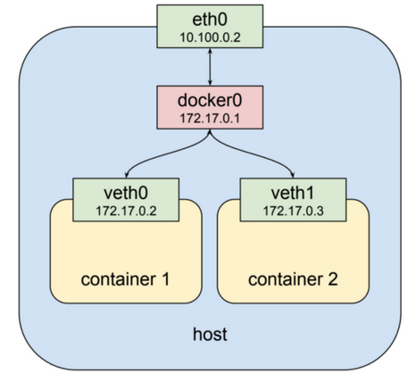

# Intro to Kubernetes

## Introduction

- We would like to have a fault-tolerant and scalable solution, which can be achieved by creating a single controller/management unit, after connecting multiple nodes together. This controller/management unit is generally referred to as a container orchestrator.
- **Containers** are an application-centric way to deliver high-performing, scalable applications on the infrastructure of your choice.
- With a **container image**, we bundle the application along with its runtime and dependencies. We use that image to create an isolated executable environment, also known as container.
- In production we want (to be)
  - fault tolerant
  - scalable on demand
  - update/rollback without downtime
  - use resources optimally
- **Container orchestrators** are the tools which group hosts together to form a cluster, and help us fulfill the requirements mentioned above.
  - Implementations: Docker Swarm, Kubernetes, Apache Mesos, Amazon ECS...
  - Capabilities:
    - Bring multiple hosts together and make them part of a cluster
    - Schedule start/stop containers

## Kubernetes

- Features:

  - Automatic binpacking (=scheduling)
  - Self-healing
  - Horizontal scaling
  - Service discovery and Load balancing -> Kubernetes groups sets of containers and refers to them via a **Domain Name System (DNS)**. This DNS is also called a Kubernetes service. Kubernetes can discover these services automatically, and load-balance requests between containers of a given service.
  - Automated rollouts and rollbacks
  - Secrets and configuration management
  - Storage orchestration
  - Batch execution

- Architecture

  - One or more **master nodes**
    - Tasks:
      - Managing the cluster
      - Entry point for administrative tasks. (Communication via CLI, GUI, API)
      - If there are more master nodes only one of them is the leader.
    - Components:
      - API server (for administrative tasks. Resulting state stored in etcd!)
      - Scheduler (has the resource/usage info for each node)
      - Controller manager (manages non-terminating control loops -> makes sure that current state = desired state)
      - etcd
  - One or more **worker nodes**
    - Tasks
      - Runs apps using **Pods**.
        - A Pod is a scheduling unit in Kubernetes.
        - It is a logical collection of one or more containers which are _always scheduled together_.
    - Components:
      - Container runtime
        - To run and manage a container's lifecycle, we need a container runtime on the worker node. Examples: `containerd`, `rkt`, `lxd`.
        - Note: Docker is a platform which uses `containerd` as a container runtime.
      - kublet
        - Agent which runs on each worker node and communicates with the master node. Also supervises the healthiness of the pods.
        - The kubelet connects to the container runtime using **Container Runtime Interface (CRI).**
          - CRI implements two services: `ImageService` and `RuntimeService`. The `ImageService` is responsible for all the image-related operations, while the `RuntimeService` is responsible for all the Pod and container-related operations.
        - CRI shims:
          - **dockershim**: containers are created using Docker installed on the worker nodes (which uses `containerd`)
          - **cri-containerd**: directly use `containerd`
            
      - kube-proxy
        -It is a network proxy which runs on each worker node and listens to the API server for each Service endpoint creation/deletion. For each Service endpoint, kube-proxy sets up the routes so that it can reach to it. -> helps to expose your service.
  - Distributed key-value store, like **etcd**.
    - The key-value store can be part of the master node. It can also be configured externally, in which case, the master nodes would connect to it.
    - Works in Raft Consensus Algorithm -> Failsafe.
      

- Networking
  - Kubernetes uses **Container Network Interface (CNI)** to assign the IP address to each Pod.
  - The container runtime offloads the IP assignment to CNI, which connects to the underlying configured plugin, like Bridge or MACvlan, to get the IP address. Once the IP address is given by the respective plugin, CNI forwards it back to the requested container runtime.
  - With the help of the underlying host operating system, all of the container runtimes generally create an isolated network entity for each container that it starts. On Linux, that entity is referred to as a **network namespace**. These network namespaces can be shared across containers, or with the host operating system. Inside a Pod, containers **share** the network namespaces, so that they can reach to each other via localhost.
    
