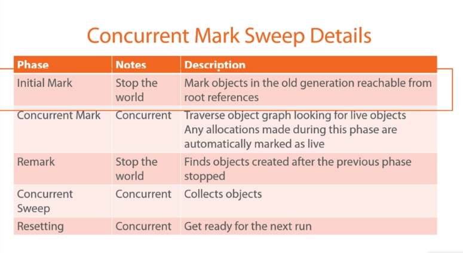
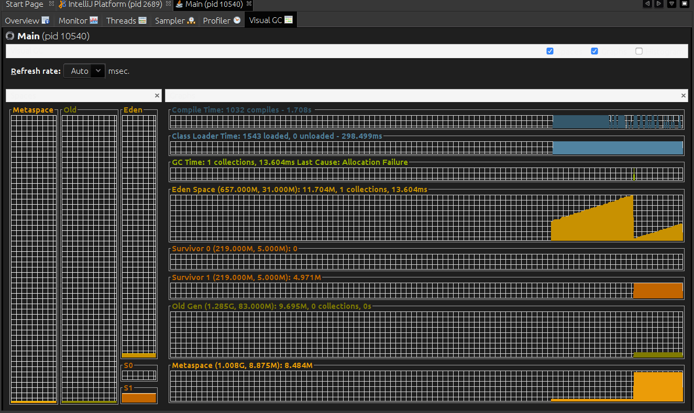

# Java Virtual Machine (Pluralsight)

#### Introduction
- Why garbage collection
  - Stop memory leaking (i.e. forgetting deleting objects referenced by pointers)
  - Avoid misunderstandings (who owns the object and who should delete it?)
- **Garbage collection promise that it claims no live object.** (If they collect and when you don't know...)
- Type of GC
  - Do Nothing (live objects won't be collected)
  - Reference counting
    - Issue: circular reference.
  - Mark and Sweep.
    - Starting from the root set we explore the path of referenced objects, marks used memory. Note that since circular references don't have external reference pointing to them won't be marked as used memory.
    - Sweep removes unused objects.
  - Copy
    - the fragmented mark and sweep memory is copied to a new space in a way that it is no longer fragmented.
  - Generational
    - Once an object survives a GC, it is promoted to a different generation. GC sweeps through the young generations more often than the old generation.
- You find a code that outputs memory addresses (06_printingMemoryAddresses).
  - Rename it to Main.java
  - compile it with javac Main.java
  - Export output to a csv: java Main > /.../out.csv
  - Open in excel and put a line chart on it. You will see a saw-tooth graph.

#### How GC works in Oracle JVM
- Requirements for GC
  - Don't pause the entire application
  - Memory fragmentation
  - Throughput
  - Multi core support
- Basic ideas
  - Initial objects allocated in `Eden space`
  - Young generation has two `Survivor spaces`
    - Only one used at a time. Objects copied between these survivor spaces.
  - Old Generation (Tenured space)
  - Permanent Generation space (never GC-d)
  - "Die young or live forever theory."
  - Process:
    - GC runs, objects are copied to "newer" survivor space.
    - Objects from "older" survivor space also copied to "newer" survivor space
    - Swap survivor sapces.
    - **Minor** GC happens when Eden is full. **Major/Full** GC happens when survivor space is full, or after a certain number of minor garbage collects.
- Allocation
  - Idea: have a pointer that points to the next free space on the heap - memory will be allocated here. Problem: what if more threads?
  - Solution: **Thread Local Allocation Buffers (TLABs)** Each thread hets its own buffer in the Eden space and threads can only allocate in their own buffer. --> No locking required.
- Card Tables
  - Object in old-gen allocates object, that is written to young-gen. (Thus old obj. has reference to new obj.) Write barrier updates the card table.
  - GC then first marks live roots and its references in the young-gen memory. Then checks young->young references. Finally card-table is checked, and this old->new refs are marked.
- Various GCs
  - Serial Collector
    - Single threaded, mark & sweep, OK for small apps.
    - Eden, Survivor, Old spces etc.
  - Parallel Collector
    - Multiple threads for minor collection
    - Single thread for major collection
    - Same process as serial btw. (eden etc.)
    - Used on severs
  - Parallel Old Collector
    - Parallel thredas for both yound and old gen GCing.
    - Preferred over Parallel
  - Concurrent Mark And Sweep
    - Only collects old space
    - Causes heap fragmentation, but faster.
  

  - G1 (signce Java 7)
    - Meant for server applications, running on multiprocessor machines with large memories.
    - Breaks (fragments) heap into regions. (**Multiple** Eden, Surv, Old spaces.)
    - G1 Young GC: Memory in Eden collected and put into a survivor regions
    - G1 Old GC: Memory discarded, eden left as it was.
- How to pick?
  - Test the app, profile it.
  - Test different GCs.

#### Monitoring GC
- Executing different GCs and pringing their properties:
  - Run code in MXBeansGC.java
  - `-XX:+UseConcMarkSweepGC`
  - `-XX:+UseG1GC`
- `jstat`
  - See GC capcaity, statistics, ongoing collections, details etc.
  - `jstat -option <pid> <interval> <count>`
  - Check the Jstat.java
    - Allocate array that will hold 1mio references to these GCMe objects.
    - Then we randomly initialize the array slots / overwrite. --> Number of young/old GCs happening and memory getting freed.
    - Run the java stuff in one terminal.
    - In another run `jps` --> find the process id, and run `jstat -gcutil ID`, `jstat -gccause ID`, `jstat gccapacity ID`, `jstat -gc ID`
- `visual VM`
  - Installed alond with JDK
  - From terminal run `jvisualvm`
  - Go to Tools -> Plugins -> Visual C install. Profile your app (select PID)

  

  #### Java Reference classes
  - Strong > Soft > Weak > Pahntom reference
  - Object not GC if there is strong ref
  - Soft
    - will be collected if there is memory pressure.
    - Usage: Caching. (If no mem. pressure still there if so, then need to fetch again.) However they are not great for caches. (So rather don't use for cache.)
  - Weak
    - will be collected immediately. (next round of GC)
    - Usage: Associate meta data with another type, WeakHashMap (see java example)
  - Phantom references
    - Usage: interaction with GC
