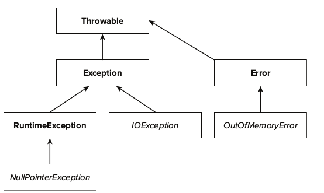

# Exceptions & Logging
Don't use errorCodes. Use exceptions.

**Key points**
1. When you throw an exception, control is transferred to the nearest handler of the
exception.
2. In Java, checked exceptions are tracked by the compiler.
3. Use the try/catch construct to handle exceptions.
4. The try-with-resources statement automatically closes resources after normal
execution or when an exception occurred.
5. Use the try/finally construct to deal with other actions that must occur
whether or not execution proceeded normally.
6. You can catch and rethrow an exception, or chain it to another exception.
7. A stack trace describes all method calls that are pending at a point of execution.
8. An assertion checks a condition, provided that assertion checking is enabled for
the class, and throws an error if the condition is not fulfilled.
9. Loggers are arranged in a hierarchy, and they can receive logging messages with
levels ranging from SEVERE to FINEST.
10. Log handlers can send logging messages to alternate destinations, and formatters
control the message format.
11. You can control logging properties with a log configuration file.

#### When to use exceptions
- Resource missing, invalid arguments, connection broken, corrupted data etc.

#### Checked vs Unchecked
- **unchecked** exceptions are used to signal about erroneous conditions related to program logic and assumptions being made (invalid arguments, null pointers, unsupported operations, …). Any unchecked exception is a subclass of `RuntimeException` and that is how Java compiler understands that a particular exception belongs to the class of unchecked ones. You shouldn't bother catching these, as literally any method can throw them.
- **checked** exceptions represent invalid conditions in the areas which are outside of the immediate control of the program (like memory, network, file system, …). Any checked exception is a subclass of `Exception`. In contrast to the unchecked exceptions, checked exceptions must be listed as a part of the method signature (using throws keyword). (So that the caller can anticipate the throw.)

  


#### Handling Exceptions
- **Try-Catch-Finally**
  - a try block that encloses the code section which might throw an exception,
    - use a separate try block for each statement that could throw an exception or
    - use one try block for multiple statements that might throw multiple exceptions.
  - one or more catch blocks that handle the exception
    - You can chain them up just like in modern C++, but a more elegant way is to `catch (MyBusinessException|NumberFormatException e) {e.printStackTrace();}`
    - NEVER catch `Throwable` object in your catch clause, casue it will catch Errors as well. (Errors are thrown by the JVM to indicate serious problems that are not intended to be handled by an application.)
    - NEVER catch, log and re-throw.
    - If you want to add additional information it’s sometimes better to catch a standard exception and to wrap it into a custom one. A typical example for such an exception is an application or framework specific business exception. When you do that, MAKE SURE to set the original exception as the cause. `catch (NumberFormatException e) {throw new MyBusinessException("A message that describes the error.", e);}`
    - Or you can add additional message and rethrow a `RuntimeException` (most common) `catch(IOException e){throw new RuntimeException(“IO Exception in Class X”,e);}`
  - a finally block which gets executed after the try block was successfully executed or a thrown exception was handled
    - It is, therefore, a good place to implement any cleanup logic, like closing a connection or an InputStream. However since java7 use the "Try with resources."
-  If you don't handle the exception you have to mark your methods as `throws exceptionName` The more specific the exception is that you throw, the better. Also write the specific reason in the Exception's message.
- Handle the exception if:
  - You are able to handle the exception within your current method
  - Exception handling would fulfill the needs of all users of your class

#### Try with resources
- The only thing you need to do to use this feature is to instantiate the object within the try clause.
- The resource must belong to a class implementing the AutoCloseable interface.

```java
public void readFile( final File file ) {
    try( InputStream in = new FileInputStream( file ) ) {
        // Some implementation here
    } catch( final IOException ex ) {
        // Some implementation here
    }
}
```

#### Own exception
- As every Java class, the exception class is part of an inheritance hierarchy. It has to extend `java.lang.Exception` or one of its subclasses.
- It is strongly advised that all user-defined exceptions should be inherited from `RuntimeException` class and fall into the class of unchecked exceptions (however, there are always exclusions from the rule).
- Follow the naming convention --> End the name with "Exception"
- Provide JavaDoc snippets!
- Provide a Constructor That Sets the Cause. E.g.:

```java
public void wrapException(String input) throws MyBusinessException {
    try {
        // do something
    } catch (NumberFormatException e) {
        throw new MyBusinessException("A message that describes the error.",
        e,
        ErrorCode.INVALID_PORT_CONFIGURATION);
    }
}
```

For example, let us defined exception to dial with authentication. That’s all you need to do to implement a custom checked exception. You can now throw the MyBusinessException in your code, specify it as part of your method signature and handle it in a catch clause.

```java

/**
 * The MyBusinessException wraps all checked standard Java exception and enriches them with a custom error code.
 * You can use this code to retrieve localized error messages and to link to our online documentation.
 *
 * @author TJanssen
 */
public class MyBusinessException extends Exception {
    private static final long serialVersionUID = 7718828512143293558 L;
    private final ErrorCode code;
    public MyBusinessException(ErrorCode code) {
        super();
        this.code = code;
    }
    public MyBusinessException(String message, Throwable cause, ErrorCode code) {
        super(message, cause);
        this.code = code;
    }
    public MyBusinessException(String message, ErrorCode code) {
        super(message);
        this.code = code;
    }
    public MyBusinessException(Throwable cause, ErrorCode code) {
        super(cause);
        this.code = code;
    }
    public ErrorCode getCode() {
        return this.code;
    }
}
```
