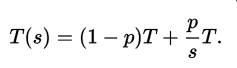
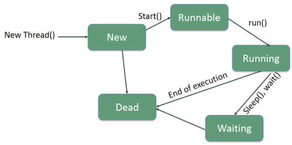

# Concurrency

1. A Runnable describes a task that can be executed asynchronously but does not
return a result.2. An ExecutorService schedules tasks instances for execution.
3. A Callable describes a task that can be executed asynchronously and yields a
result.
4. You can submit one or more Callable instances to an ExecutorService
and combine the results when they are available.
5. When multiple threads operate on shared data without synchronization, the result
is unpredictable.
6. Prefer using parallel algorithms and threadsafe data structures over programming
with locks.
7. Parallel streams and array operations automatically and safely parallelize
computations.
8. A ConcurrentHashMap is a threadsafe hash table that allows atomic update of
entries.
9. You can use AtomicLong for a lock-free shared counter, or use LongAdder if
contention is high.
10. A lock ensures that only one thread at a time executes a critical section.
11. An interruptible task should terminate when the interrupted flag is set or an
InterruptedException occurs.
12. A long-running task should not block the user-interface thread of a program, but
progress and final updates need to occur in the user-interface thread.
13. The Process class lets you execute a command

#### Threads vs processes
A process runs independently and isolated of other processes. It cannot directly access shared data in other processes. The resources of the process, e.g. memory and CPU time, are allocated to it via the operating system.

A thread is a so called lightweight process. It has its own call stack, but can access shared data of other threads in the same process. Every thread has its own memory cache. If a thread reads shared data it stores this data in its own memory cache. A thread can re-read the shared data.

The theoretical possible performance gain can be calculated by the following rule which is referred to as Amdahl’s Law.



(Where `p` is the % of the code that can be parallelized, `s` is the number of cores/threads and `T` is the original (single threaded) total time. Then T/T(s) will be your speedup.)


#### Threads
Every Java thread has a priority that helps the operating system determine the order in which threads are scheduled. Java thread priorities are in the range between MIN_PRIORITY (a constant of 1) and MAX_PRIORITY (a constant of 10). By default, every thread is given priority NORM_PRIORITY (a constant of 5).

Multiple threads run concurrently, by using separate processors or different time slices on the same processor.

In the Java concurrency library, an **executor service schedules** and executes tasks, choosing the threads on which to run them.

**Thread states**
During its execution, a thread can reside in one of the following states:
* New: A new thread begins its life cycle in the new state. It remains in this state until the program starts the thread. It is also referred to as a born thread.
* Runnable: A thread becomes ready to run, but does not necessarily start running immediately.
* Running: The processor is actively executing the thread code.
* Waiting: A thread is in a blocked state waiting for some external processing to finish.
* Sleeping: The thread is forced to sleep.
* Blocked on I/O: Waiting for an I/O operation to complete.
* Blocked on Synchronization: Waiting to acquire a lock.
* Dead: The thread has finished its execution.



In java there are 3 ways to create a thread:
* A class may implement the [Runnable](http://docs.oracle.com/javase/7/docs/api/java/lang/Runnable.html) interface.
* A class may extend the [Thread](http://docs.oracle.com/javase/7/docs/api/java/lang/Thread.html) class.
* An application can use the [Executor](http://docs.oracle.com/javase/7/docs/api/java/util/concurrent/Executor.html) framework, in order to create a thread pool.

**Create a Thread by Implementing a Runnable Interface**
- Implement a run() method provided by a Runnable interface.
  - You will put your complete business logic inside this method.
- Instantiate a Thread object using the following constructor `Thread(Runnable threadObj, String threadName);`
- Start it by calling start() method, which executes a call to run( ) method.

```java
public class Main {
    public static void main(String[] argv) {
        RunnableDemo R1 = new RunnableDemo( "Thread-1");
        R1.start();

        RunnableDemo R2 = new RunnableDemo( "Thread-2");
        R2.start();
    }
}

class RunnableDemo implements Runnable {
    private Thread t;
    private String threadName;

    RunnableDemo(String name) {
        threadName = name;
        System.out.println("Createing " + threadName);

    }

    @Override
    public void run() {
        System.out.println("Running " + threadName);
        try {
            for(int i = 4; i > 0; i--){
                System.out.println("Thread: " + threadName + ", " + i);
                Thread.sleep(50);
            }
        } catch (InterruptedException e){
            System.out.println("Thread" + threadName +  " interrupted");
        }
        System.out.println("Thread" + threadName + " exiting");
    }

    // Don't confuse it with Thread's start() method!
    public void start() {
        System.out.println("Starting " + threadName);
        if(t == null) {
            t = new Thread(this, threadName);
            t.start();
        }
    }
}
```
- Runnables have the major advantage that they don't require a class, hence they can be written as lambda expressions:

```java
Runnable task = () -> { ... };
Thread thread = new Thread(task);
thread.start();
```

**Extending the Thread class**  
This approach provides more flexibility in handling multiple threads created using available methods in Thread class.
- You will need to override `run( )` method available in Thread class.
- Create thread object
- Call `start()`

The code is the same as before, but you are now  **extending** the `Thread` class instead of **implementing** `Runnable` interface.

Furthermore the thread class has fancy functions, that allows you to fine-tune your application:
- `public final void setPriority(int priority)`
- `public final void setDaemon(boolean on)` True --> then thread will be denoted as a daemon thread.  (A daemon thread is a thread that does not prevent the JVM from exiting when the program finishes but the thread is still running. An example for a daemon thread is the garbage collection. For posterity, setDamon(boolean) can only be called before the thread has been started. )
- `public final void join(long millisec)` The current thread invokes this method on a second thread, causing the current thread to block until the second thread terminates or the specified number of milliseconds passes.
- `public final boolean isAlive()` Returns true if the thread is alive, which is any time after the thread has been started but before it runs to completion.
- `isInterrupted()` Each thread has an interrupted status that indicates that someone would like to “interrupt” the thread. A Runnable can check for this status, which is typically done in a loop:

```java
Runnable task = () -> {
  while (more work to do) {
    if (Thread.currentThread().isInterrupted()) return;
    Do more work
  }
};
```

**Using the executor threadpool**

```java
public class Main {
    private static final int NTHREDS = 10;

    public static void main(String[] args) {
        ExecutorService executor = Executors.newFixedThreadPool(NTHREDS);
        for (int i = 0; i < 500; i++) {
            Runnable worker = new MyRunnable(10000000L + i);
            executor.execute(worker);
        }
        // This will make the executor accept no new threads
        // and finish all existing threads in the queue
        executor.shutdown();
        // Wait until all threads are finish
        executor.awaitTermination();
        System.out.println("Finished all threads");
    }
}
```

- The call `exec = Executors.newCachedThreadPool();` yields an executor service **optimized for programs with many tasks that are short lived or spend most of their time waiting.** Each task is executed on an idle thread if possible, but a new thread is allocated if all threads are busy. There is no bound on the number of concurrent threads.

- The call `exec = Executors.newFixedThreadPool(nthreads);` yield a **pool with a fixed number of threads**. **When you submit a task, it is queued up until a thread becomes available. This is a good choice to use for computationally intensive tasks, or to limit the resource consumption of a service.** You can derive the number of threads from the number of available processors, which you obtain as `int processors = Runtime.getRuntime().availableProcessors();`

#### Thread safety
**Visibility**
A visibility problem occurs if thread A reads shared data which is later changed by thread B and thread A is unaware of this change.
Modern compilers, virtual machines, and processors perform many optimizations. These optimizations **assume that the code is sequential unless explicitly told otherwise.**

The code `while (!done) i++;` running on thread `II.` will be optimized to `if (!done) while (true) i++;`, as the thread doesn't realize that the value of `done` can change (e.g.: by another thread) **Declaring a variable `volatile` solves the issue of visibility.**

**Race condition**
You have non-atomic operations, and 2 threads overwrite each other with wrong values. **Solution: Use atomic operatos or locks**

**Strategies for Safe Concurrency**
- 1) Don't share. Count separately on local vars in threads and sum the values at the end.
- 2) Use Atomic operations
- 3) Use thread-safe data structures.
- 4) Locking


**1) Don't share**  
The ThreadLocal class in Java enables you to create variables that can only be read and written by the same thread. Thus, even if two threads are executing the same code, and the code has a reference to a ThreadLocal variable, then the two threads cannot see each other's ThreadLocal variables.

Sometimes, you can avoid sharing by giving each thread its own instance, using the `ThreadLocal` helper class.

```java
public static class MyRunnable implements Runnable {
    private ThreadLocal<Integer> threadLocal =
            new ThreadLocal<Integer>();

    @Override
    public void run() {
        threadLocal.set( (int) (Math.random() * 100D) );

        try {
            Thread.sleep(2000);
        } catch (InterruptedException e) {
        }

        System.out.println(threadLocal.get());
    }
}
```

**2) Atomic operations**  
There are a number of classes in the java.util.concurrent.atomic package that use safe and efficient machine-level instructions to guarantee atomicity of operations on integers, long and boolean values, object references, and arrays thereof.
- `long id = nextNumber.incrementAndGet();`

It is guaranteed that the correct value is computed and returned, even if multiple threads access the same instance concurrently.

```java
public static AtomicLong largest = new AtomicLong();
// In some thread...
largest.set(Math.max(largest.get(), observed)); // Error—race condition!

largest.updateAndGet(x -> Math.max(x, observed)); // Goood
largest.accumulateAndGet(observed, Math::max); // Good
```

**3) Thread-safe data structures**  
The collections in the java.util.concurrent package have been cleverly implemented so that multiple threads can access them without blocking each other, provided they access different parts.

- Concurrent Hash Maps  
  - NON thread safe:

    ```java
    ConcurrentHashMap<String, Long> map = new ConcurrentHashMap<>();
    ...
    Long oldValue = map.get(word);
    Long newValue = oldValue == null ? 1 : oldValue + 1;
    map.put(word, newValue); // Error—might not replace oldValue
    ```

  - Use the `compute` method. The compute method is atomic, no other thread can mutate the map entry while the computation is in progress. There are also variants `computeIfPresent` and `computeIfAbsent` that only compute a new value when there is already an old one, or when there isn’t yet one.
    ```java
    map.compute(word, (k, v) -> v == null ? 1 : v + 1);
    ```
  - Use the `merge` method hen a key is added for the first time.
    ```java
    map.merge(word, 1L, (existingValue, newValue) -> existingValue +
    newValue);
    ```

- Blocking queue
  - One commonly used tool for coordinating work between tasks is a blocking queue. Producer tasks insert items into the queue, and consumer tasks retrieve them. The queue lets you safely hand over data from one task to another. When you try to add an element and the queue is currently full, or you try to remove an element when the queue is empty, the operation blocks. In this way, the queue balances the workload. If the producer tasks run slower than the consumer tasks, the consumers block while waiting for the results. If the producers run faster, the queue fills up until the consumers catch up.
  - If you anticipate high contention, you should simply use a LongAdder instead of an AtomicLong.


**4) Locking**  
- `synchronized`
  - Java provides locks to protect certain parts of the code to be executed by several threads at the same time. The simplest way of locking a certain method or Java class is to define the method or class with the `synchronized` keyword.
  - The synchronized keyword in Java ensures:
    - that only a single thread can execute a block of code at the same time
    - that each thread entering a synchronized block of code sees the effects of all previous modifications that were guarded by the same lock
  ```java
  public synchronized void critial() {
    // some thread critical stuff
    // here
  }
  ```
- `lock`
  - You can also use the synchronized keyword to protect blocks of code within a method. This block is guarded by a key, which can be either a string or an object. This key is called the lock.
  - All code which is protected by the same lock can only be executed by one thread at the same time.

    ```java
    Lock countLock = new ReentrantLock();
    int count; // Shared among multiple threads
    ...
    countLock.lock();
    try {
      count++; // Critical section
    } finally {
      countLock.unlock(); // Make sure the lock is unlocked
    }
    ```
  - Note that, by placing the unlock method into a finally clause, **the lock is released if any exception happens** in the critical section. Otherwise, the lock would be permanently locked, and no other thread would be able to proceed past it.

For that reason, application programmers should **use locks as a matter of last resort**. First try to avoid sharing, by using immutable data or handing off mutable data from one thread to another. If you must share, use pre-built thread-safe structures such as a ConcurrentHashMap or a LongAdder. Still, it is useful to know about locks so you can understand how such data structures can be implemented.


**Waiting condition**  
Imagine a scenario where there is a master thread that is putting the tasks into a pipeline. The worker threads keep taking the elements from this "stack".

```java
public synchronized Object take() {
  if (head == null) ... // Now what?
  Node n = head;
  head = n.next;
  return n.value;
}
```
- If the head is null there are no process to fetch from the queue. -> Have to wait until somebody puts there an element. --> **wait()**

```java
public synchronized Object take() throws InterruptedException {
  while (head == null) wait();
  ...
}
```
- Note that the wait method is a method of the Object class. It relates to the lock that is associated with the object.
- The thread is not made runnable when the lock is available.
Instead, it stays deactivated until another thread has called the `notifyAll()` method on the same object.

```java
public synchronized void add(Object newValue) {
  ...
  notifyAll();
}
```

When implementing data structures with blocking methods, the wait, `notify`, and `notifyAll` methods are appropriate. But they are not easy to use properly. Application programmers should never have a need to use these methods. Instead, use prebuilt data structures such as LinkedBlockingQueue or ConcurrentHashMap.


#### Futures and Callables
A `Runnable` carries out a task, but it doesn't yield a value. If you have a task that computes a result, use the `Callable<V>` interface instead. Its `call` method, unlike the `run` method of the `Runnable` interface, returns a value of type `V`.

If you submit a Callable object to an Executor, the framework returns an object of type `java.util.concurrent.Future`. `Future` exposes methods allowing a client to monitor the progress of a task being executed by a different thread. Therefore, a `Future` object can be used to check the status of a Callable. It can also be used to retrieve the result from the Callable.

In the following example we have a class MyCallable that sums up the numbers from 0 to 100 and returns it at the end. In the main method, we create a list of `Future<Longs>`. Then we create and submit this "Callable" to the execute and store the returned `Future` in this list. At the end you collect the results from the futures.

```java
public class MyCallable implements Callable<Long> {

    @Override
    public Long call() throws Exception {
        long sum = 0;
        for (long i = 0; i <= 100; i++) {
            sum += i;
        }
        return sum;
    }
}

public class CallableFutures {
    private static final int NTHREDS = 10;

    public static void main(String[] args) {

        ExecutorService executor = Executors.newFixedThreadPool(NTHREDS);
        List<Future<Long>> list = new ArrayList<Future<Long>>();
        for (int i = 0; i < 20000; i++) {
            Callable<Long> worker = new MyCallable();
            Future<Long> submit = executor.submit(worker);
            list.add(submit);
        }
        long sum = 0;
        System.out.println(list.size());
        // now retrieve the result
        for (Future<Long> future : list) {
            try {
                sum += future.get();
            } catch (InterruptedException e) {
                e.printStackTrace();
            } catch (ExecutionException e) {
                e.printStackTrace();
            }
        }
        System.out.println(sum);
        executor.shutdown();
    }
}
```

The Future interface has the following methods:
- `get()`: The get method blocks until the result is available or until the timeout has been reached. That is, the thread containing the call does not progress until the method returns normally or throws an exception. If the `call` method yields a value, the get method returns that value. If the `call` method throws an exception, the get method throws an `ExecutionException` wrapping the thrown exception. If the timeout has been reached, the get method throws a `TimeoutException`.
- `cancel()`: The cancel method attempts to cancel the task. If the task isn't already running, it won't be scheduled. Otherwise, if mayInterruptIfRunning is true, the thread running the task is interrupted.

**Starting multiple tasks at once**  
A task may need to wait for the result of multiple subtasks. Instead of submitting each subtask separately, you can use the invokeAll method, passing a Collection of Callable instances.

```java
String word = ...;
Set<Path> paths = ...;
List<Callable<Long>> tasks = new ArrayList<>();
for (Path p : paths) tasks.add(
  () -> { return number of occurrences of word in p });
List<Future<Long>> results = executor.invokeAll(tasks);
// This call blocks until all tasks have completed
long total = 0;
for (Future<Long> result : results) total += result.get();
```

The `invokeAny` method is like `invokeAll`, but it returns as soon as any one of the submitted tasks has completed normally, without throwing an exception. It then returns the value of its Future. The other tasks are cancelled.

The Future interface is limited as a model of asynchronously executed tasks. Future allows a client to query a Callable task for its result. It does not provide the option to register a callback method. A callback method would allow you to get a callback once a task is done. However as of Java 8 we can do thus using the `CompletableFuture`.

#### Asynchronous Computations
When you have a `Future` object, you need to call `get` to obtain the value, blocking until the value is available. The `CompletableFuture` class implements the `Future` interface, and it provides a second mechanism for obtaining the result. You register a callback that will be invoked (in some thread) with the result once it is available.

Beside implementing the Future interface, `CompletableFuture` also implements the `CompletionStage` interface.
A `CompletionStage` is a promise. It promises that the computation eventually will be done.
The great thing about the `CompletionStage` is that it offers a vast selection of methods that let you attach callbacks that will be executed on completion.
This way we can build systems in a non-blocking fashion.

You can create a CompletableFuture simply by using the following no-arg constructor: `CompletableFuture<String> completableFuture = new CompletableFuture<String>();` All the clients who want to get the result of this CompletableFuture can call CompletableFuture.get() method: `String result = completableFuture.get()` The `get()` method blocks until the Future is complete. So, the above call will block forever because the Future is never completed. You can use `CompletableFuture.complete()` method to manually complete a Future: `completableFuture.complete("Future's Result")` All the clients waiting for this Future will get the specified result. And, Subsequent calls to `completableFuture.complete()` will be ignored.

**runAsync()**
If you want to run some background task asynchronously and don’t want to return anything from the task, then you can use `CompletableFuture.runAsync()` method. It takes a Runnable object and returns `CompletableFuture<Void>`.

```java
// Using Lambda Expression
CompletableFuture<Void> future = CompletableFuture.runAsync(() -> {
    try {
        TimeUnit.SECONDS.sleep(1);
        System.out.println("I'll run in a separate thread than the main thread.");
    } catch (InterruptedException e) {
        e.printStackTrace();
    }
});

// Block and wait for the future to complete
future.get()
```
`CompletableFuture.runAsync()` is useful for tasks that don’t return anything. But what if you want to return some result from your background task?


**supplyAsync()**  
supplyAsync Example: `CompletableFuture.supplyAsync(this::sendMsg);`
- `supplyAsync` takes a Supplier containing the code we want to execute asynchronously — in our case the `sendMsg` method.

```java
CompletableFuture<String> future = CompletableFuture.supplyAsync(() -> {
    try {
        TimeUnit.SECONDS.sleep(1);
    } catch (InterruptedException e) {
        e.printStackTrace();
    }
    return "My name is Tom.";
});

// Block and get the result of the Future
String result = future.get();
System.out.println(result);
```

You might be wondering that - Well, I know that the runAsync() and supplyAsync() methods execute their tasks in a separate thread. But, we never created a thread right?
*CompletableFuture executes these tasks in a thread obtained from the global ForkJoinPool.commonPool()!!!* However all the functions have a form where you can pass your own executor (`static CompletableFuture<Void>	runAsync(Runnable runnable, Executor executor)`)

The CompletableFuture.get() method is blocking. It waits until the Future is completed and returns the result after its completion. Let's fix this issue of ours. You can attach a callback to the CompletableFuture using `thenApply(), thenAccept() and thenRun()` methods!

**thenApply()**  
You can use thenApply() method to process and transform the result of a CompletableFuture when it arrives. It takes a Function<R,T> as an argument. Function<R,T> is a simple functional interface representing a function that accepts an argument of type T and produces a result of type R. Taking the previous future we can write:

```java
CompletableFuture<String> greetingFuture = whatsYourNameFuture.thenApply(name -> {
   return "Hello " + name;
});

// Block and get the result of the future.
System.out.println(greetingFuture.get()); // Hello Rajeev
```

You can also write a sequence of transformations on the CompletableFuture by attaching a series of thenApply() callback methods. The result of one thenApply() method is passed to the next in the series. ("Chaining")

**thenAccept(), thenRun()**  
If you don’t want to return anything from your callback function and just want to run some piece of code after the completion of the Future, then you can use `thenAccept()` and `thenRun()` methods. These methods are consumers and are often used as the last callback in the callback chain.

While `thenAccept()` has access to the result of the `CompletableFuture` on which it is attached, `thenRun()` doesn’t even have access to the Future’s result. It takes a Runnable and returns `CompletableFuture<Void>`.

```java
CompletableFuture.supplyAsync(() -> {
	return ProductService.getProductDetail(productId);
}).thenAccept(product -> {
	System.out.println("Got product detail from remote service " + product.getName())
});

// thenRun() example
CompletableFuture.supplyAsync(() -> {
    // Run some computation  
}).thenRun(() -> {
    // Computation Finished.
});
```

**Example 1: Combine two dependent futures using thenCompose()**
Let’s say that you want to fetch the details of a user from a remote api service and once the user’s detail is available, you want to fetch his Credit rating from another service.

```java
CompletableFuture<User> getUsersDetail(String userId) {
	return CompletableFuture.supplyAsync(() -> {
		UserService.getUserDetails(userId);
	});
}

CompletableFuture<Double> getCreditRating(User user) {
	return CompletableFuture.supplyAsync(() -> {
		CreditRatingService.getCreditRating(user);
	});
}

// Nested CompletableFuture, not good.
CompletableFuture<CompletableFuture<Double>> result = getUserDetail(userId)
.thenApply(user -> getCreditRating(user));

CompletableFuture<Double> result = getUserDetail(userId)
.thenCompose(user -> getCreditRating(user));
```

*!!! In earlier examples, the `Supplier` function passed to `thenApply()` callback would return a simple value but in this case it is returning a `CompletableFuture`. Therefore, the final result in the above case is a nested `CompletableFuture` !!!* If you want the final result to be a top-level Future, use `thenCompose()` method instead. (So, Rule of thumb here - If your callback function returns a `CompletableFuture`, and you want a flattened result from the `CompletableFuture` chain (which in most cases you would), then use `thenCompose()`)

**Example 2: Combine two independent futures using thenCombine()**
While `thenCompose()` is used to combine two Futures where one future is dependent on the other, `thenCombine()` is used when you want two Futures to run independently and do something after both are complete. The callback function passed to `thenCombine()` will be called when both the Futures are complete.

```java
System.out.println("Retrieving weight.");
CompletableFuture<Double> weightInKgFuture = CompletableFuture.supplyAsync(() -> {
    try {
        TimeUnit.SECONDS.sleep(1);
    } catch (InterruptedException e) {
        e.printStackTrace();
    }
    return 65.0;
});

System.out.println("Retrieving height.");
CompletableFuture<Double> heightInCmFuture = CompletableFuture.supplyAsync(() -> {
    try {
        TimeUnit.SECONDS.sleep(1);
    } catch (InterruptedException e) {
        e.printStackTrace();
    }
    return 177.8;
});

System.out.println("Calculating BMI.");
CompletableFuture<Double> combinedFuture = weightInKgFuture
        .thenCombine(heightInCmFuture, (weightInKg, heightInCm) -> {
    Double heightInMeter = heightInCm/100;
    return weightInKg/(heightInMeter*heightInMeter);
});

System.out.println("Your BMI is - " + combinedFuture.get());
```

**"Spin-offs":**
- `CompletableFuture.allOf()`
  - CompletableFuture.allOf is used in scenarios when you have a List of independent futures that you want to run in parallel and do something after all of them are complete.
- `CompletableFuture.anyOf()`
  -  as the name suggests, returns a new CompletableFuture which is completed when any of the given CompletableFutures complete, with the same result

**Exception handling**
- The `exceptionally()` callback gives you a chance to recover from errors generated from the original Future. You can log the exception here and return a default value.
- The API also provides a more generic method - `handle()` to recover from exceptions. It is called whether or not an exception occurs.
// TODO Maybe more research here!

#### Parallel algorithms
- Streams can be parallelized via `parallelStream()`
- Parallel Array Operations
  - `Arrays.parallelSetAll` set all elements in array to value in parallelSetAll
  - `Arrays.parallelSort` sort an array of primitive values or objects
    - `Arrays.parallelSort(words, Comparator.comparing(String::length));`


#### Processes
Start the building process by specifying the command that you want to execute. You can supply a List<String> or simply the strings that make up the command.

Each process has a working directory, which is used to resolve relative directory names. By default, a process has the same working directory as the virtual machine, which is typically the directory from which you launched the java program. You can change it with the directory method:

```java
ProcessBuilder builder = new ProcessBuilder("gcc", "myapp.c");
builder = builder.directory(path.toFile());

Process p = new ProcessBuilder(command).directory(file).start();
```

Next, you will want to specify what should happen to the standard input, output, and error streams of the process. By default, each of them is a pipe that you can access with

```java
OutputStream processIn = p.getOutputStream();
InputStream processOut = p.getInputStream();
InputStream processErr = p.getErrorStream();
```

After you have configured the builder, invoke its start method to start the process. If you configured the input, output, and error streams as pipes, you can now write to
the input stream and read the output and error streams.

```java
Process process = new ProcessBuilder("/bin/ls", "-l")
  .directory(Paths.get("/tmp").toFile())
  .start();
try (Scanner in = new Scanner(process.getInputStream())) {
  while (in.hasNextLine())
  System.out.println(in.nextLine());
}
```

To wait for the process to finish, call `int result = process.waitFor();``or:

```java
long delay = ...;
if (process.waitfor(delay, TimeUnit.SECONDS)) {
  int result = process.exitValue();
  ...
} else {
  process.destroyForcibly();
}
```

Finally, you can receive an asynchronous notification when the process has completed. The call`` process.onExit()`` yields a ``CompletableFuture<Process> ``that you can use to schedule any action.
