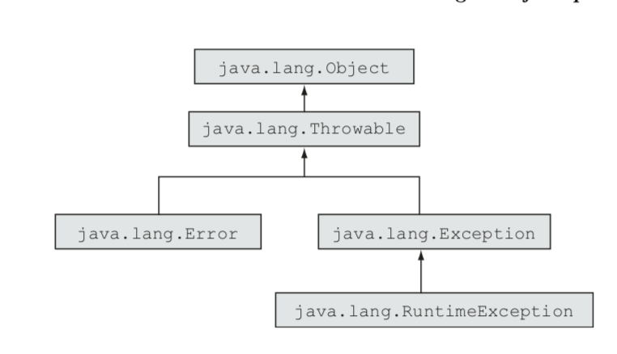

# Exception handling

#### Exceptions in Java
- Use: Instead of writing if-else clauses inside each other, write the block of code once (in the `try` part) and then catch the different exceptions at the end. --> Code readability/maintainability

#### Exception categories
- **Exception hierarchy**
  - all extend the class `java.lang.Throwable`



- **Checked exceptions**
  - A checked exception is an unacceptable condition **foreseen** by the author of a method but outside their immediate control. For an example, FileNotFound- Exception is a checked exception.
  - Checked exceptions are checked during compilation (since they are documented in the API)
  - A checked exception is a subclass of the class `java.lang.Exception`, but it’s not a subclass of `java.lang.RuntimeException`. It’s interesting to note, how- ever, that the class `java.lang.RuntimeException` itself is a subclass of the class `java.lang.Exception`.
- **Runtime (or unchecked) exceptions**
  - `NullPointerException`, `ArrayIndexOutOfBoundsException`, `ClassCastException`
  - A runtime exception is a representation of a programming error.
  - A runtime exception is named so because it isn’t feasible to determine whether a method call will throw a runtime exception until it executes.
  - A runtime exception is a subclass of java.lang.RuntimeException.
  - Adding runtime exceptions or errors to a method’s declaration isn’t required. A method can throw a runtime exception or error irrespective of whether its name is included in its throws clause.
- **Errors**
  - `NoClassDefFoundError` (JVM unable to locate .class file), `StackOverflowError`
  - An error is a serious exception thrown by the JVM as a result of an error in the environment state that processes your code.
  - An **error can be caught** by an exception handler, **but it shouldn’t be**.
- **Throwing**
  - Anything that is "Throwable"
    - `throw new BookNotFoundException();` - with the `new` keyword
    - The `teachClass()` method doesn’t handle `BookNotFoundException` because its responsibilities don’t include working around a missing book.
- A method can declare to throw any type of exception, checked or unchecked, even if it doesn’t do so. But a try block can’t define a catch block for a checked exception (other than Exception) if the try block doesn’t throw that checked exception or use a method that declares to throw that checked exception.
```java
// OK
void method9() {
        try {}
        catch (RuntimeException/Throwable/Exception/Error e) {}
    }
// NOT OK, try doesn't have any clause that would throw checked exception that could be handled by the catch block.
void method10() {
        try {}
        catch (FileNotFoundException e) {}
    }
```
- **Try `catch` `finally`**
  - Finally, you execute a set of code, in all conditions, regardless of whether the code in the try block throws any exceptions.
  - For a try block, you can define multiple `catch` blocks but only a single `finally` block.
  - **A `finally` block can’t be placed before the `catch` blocks.**
- **Handle or declare, or both?**
  - You can handle the exception locally. In this case the method signature doesn't contain the exception.
  - You can declare the exception in the method signature and not handle it.
  - You can declare and handle it at the same time.
  - It’s interesting to note that **a `finally` block will execute even if the code in the try block or any of the `catch` blocks defines a return statement**.
  - **The `finally` won't execute if:**
    - Application termination—The try or the `catch` block executes `System.exit`, which immediately terminates the application.
    - Fatal errors - A crash of the JVM or the OS occurs.
  - If both the `catch` and `finally` blocks define return statements, the calling method will receive a value from the `finally` block.
  - If the `catch` block returns a primitive type the `finally` clause can't modify it (Control in the `catch` block copies the value of returnVal to be returned before it executes the `finally` block, so the returned value is not modified when `finally` executes.) --> **Copies by value, hence when having references it WILL overwrite.**
    ```java
    int returnVal = 10;
    try {
      String[] students = {"Harry", "Paul"}; System.out.println(students[5]);
    } catch (Exception e) {
      System.out.println("About to return :" + returnVal);
      return returnVal;
    } finally {
      returnVal += 10; // WONT WORK, main method will get 10 as value!
      System.out.println("Return value is now :" + returnVal);
    }
    ```
  - The order of `catch` blocks doesn't matter for unrelated classes.
- **Misc**
  - You can have nested try-catch-finally blocks.


#### Specific exceptions
- **`ArrayIndexOutOfBoundsException` and `IndexOutOfBoundsException`**
  - The former is a subclass of the latter.
  - An `ArrayIndexOutOfBoundsException` is thrown when a piece of code tries to access an **array** out of its bounds
  - An `IndexOutOfBoundsException` is thrown when a piece of code tries to access a **list**, like an `ArrayList`, using an illegal index
- **`ClassCastException`**
  - A `ClassCastException` is thrown when an object fails an IS-A test with the class type to which it’s being cast.
- **`IllegalArgumentException`**
  - As the name of this exception suggests, `IllegalArgumentException` is thrown to specify that a method has passed illegal or inappropriate arguments.
- **`NullPointerException`**
  - This exception is thrown by the JVM if you try to access a non-static method or a variable through a null value.
  - By default, the static and instance variables of a class are assigned a null value.
  - **By default local variables aren’t assigned a value—not even a null value.**
    ```java
    import java.util.ArrayList;
    class ThrowNullPointerException {
      public static void main(String[] args) {
        ArrayList<String> list; if (list!=null)
        list.add("1"); /// FAILS TO COMPILE
       }
    }
    ```
- **`ArithmeticException`**
  - When the JVM encounters an exceptional mathematical condition, like dividing an integer by zero, it throws `ArithmeticException`
    - Integer division by zeroA floating-point division by zero won’t throw any exception but rather will return ±Infinity or NaN, depending on the first operand.
  - `int y = (int)(0.99);` --> is **`ZERO`**
  - If you divide a positive decimal value by 0, the result is Infinity. If you divide a negative decimal value by 0, the result is -Infinity.
    - `System.out.println(77.0/0);` - Positive inf
    - `System.out.println(0.0/0);` - NaN (Not a Number)
- **`NumberFormatException`**
  - Subclass of `IllegalArgumentException`
  - It’s thrown to indicate that the application tried to convert a string (with an inappropriate format) to one of the numeric types.
  - Starting in Java 7, you can use underscores (_) in numeric literal values. **But you can’t use them in String values passed to the method parseInt**.
  - **Watch out!** `Integer.parseInt("123ABCD", 16)` **WORKS** because you have specified the base (hexadecimal)

#### Specific Errors
- **`ExceptionInInitializerError`**
  - The `ExceptionInInitializerError` error is typically thrown by the JVM when a static initializer in your code throws any type of `RuntimeException`.
    ```java
    // ExceptionInInitializerError
    static {
        int num = Integer.parseInt("sd", 16);
    }

    // java.lang.ExceptionInInitializerError
    static String getName() {
        throw new MyException(); // runtime exception
    }
    ```
- **`StackOverflowError`**
  - This error is thrown by the JVM when a Java program calls itself so many times that the memory stack allocated to execute the Java program “overflows” (overflows means that the stack exceeds a certain size)
- **`NoClassDefFoundError`**
  - JVM unable to load the class or the .class file was not found etc.
  - Subclass of `java.lang.LinkageError`
- **OutOfMemoryError**
  - subclass of `java.lang.VirtualMachineError`

#### Key takeaways
- Watch out for Exception subclasses. They might put a catch block with `IndexOutOfBoundsException` before the `ArrayIndexOutOfBoundsException` and ask which gets triggered. Since the former is a parent class of the latter, the first catch is executed!
