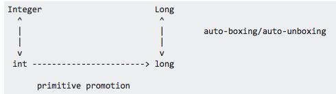
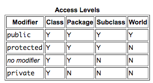

# Learnings

- String and StringBuilder are both **FINAL** classes.
- The loop variable in the enhanced for loop refers to a copy of the array or list element.
  - Copy of primitive types, copy of references.
- If StackOverflow error is caught you **CAN** use the catch to print. (No crash of JVM)
- If you initialise a variable within an if or else-if construct, the compiler can’t be sure whether these conditions will evaluate to true, resulting in no initialisation of the local variable.
- **Statements like "ARE GARBAGE COLLECTED" are FALSE** as you never know for sure when these are GC-d.
- StringBuilder has **NO** concat method! (The String class has!)
- StringBuilder(5*20) creates a SB **with the capacity** of 100!
- The elements of an ArrayList can’t be added to a higher position if lower positions are available.
  - `list.add(1, "Mike")` - Runtime error if no 0th element defined!
- `new Diary().setPageCount(200);` --> valid line even if not assigned to anything.
- `do while` --> **without** braces **only** one line allowed.
- It **will compile** if you cast unrelated classes. Only at runtime it throws exception. Casting = "i know what im doing"
  - `Roamable var = (Roamable)new Phone();` (Unrelated classes)
- A base class can use reference variables and objects of its derived classes.
- `ClassNotFoundException` is an exception that occurs when you try to load a class at **run time** using `Class.forName()` or `loadClass()` methods and mentioned classes are not found in the classpath.
- `NoClassDefFoundError` is an error that occurs when a particular class is present at **compile time**, but was missing at run time.
- `LocalDate`, `LocalDateTime`, `LocalTime` implement the `TemporalAccessor` interface.
  - `get(TemporalField field)`
  - `query(TemporalQuery<R> query)`
- Functional interface = only one abstract method (optionally more default/static)
- It is not possible to make things less visible on subclasses as once you have a superclass reference you would be able to access this stuff. (A default method cannot be overriden to private!)
- Interfaces won't have "public" or "abstract" in their signature. (They are implicitly these, tho)
- An abstract method is defined only so that it can be overridden in a subclass. However, **static methods can not be overridden**. Therefore, it is a compile-time error to have an abstract, static method.
- A **private** method **cannot** be **abstract**. (There is no one to extend and implement the method...)
- When you compare int == Integer types an unboxing is done, and it is a regular int comparison then.
- Autoboxing, and primitive promotion. Keep in mind.
    
- The `extends` keyword has to be before the `implements` keyword.
- Static initializer blocks must be able to complete normally. (Hence you can't put an "obligatory" throw new Exception, that is 100% triggered.)
- The overriding method **can't** throw a wider range of exceptions. (The caller who is using polymorphism might not expect the wider range!!!)
- A class cannot override the super class's constructor.
- Covariant return types
  - The subclass method's return type R2 may be different from superclass method's return type R1, but R2 should be a subtype of R1. i.e., subclass can return type may be a subtype of superclass return type.
- `super();` is automatically added if the sub class constructor doesn't call any of the super class's constructors.
- You can either call `super(<appropriate list of arguments>)` or `this(<appropriate list of arguments>)` but not both from a constructor.
- The package `java.lang` is imported into every Java class


#### Java Basics
- A .java file may define at most one public class.
- A **non-static** main method can access both class and instance variables, while a **static main** can only access static variables.
- There are no such thing as sub-packages in Java.
  - `java.util.stream` is not a sub-pacakge of `java.util`. Therefore import `java.util.*` doesn't import the classes of `java.util.stream`.
- Main method of java:
  - Note that the modifier `final` is optional and may be added to the method signature.
- `java` command.
  - The `java` command uses a period (`.`) to separate packages, not a slash (/)
- You **can** compile a java file without a proper entry point, but it will throw an exception at runtime!
- Protected = this class, **package**, classes that extend me.
  - Hence: public < protected < default < private
    
- The following is valid:
  ```java
  String course = //this is a comment
              "eJava";
  String var = /*hehe */"Stringvar";
  String var2 = /*hehe */
  "Stringvar";
  String name = "/* Harry */ Paul"; // The comment is PART OF THE STRING!
  ```
  - However you **can't** break a string value (enclosed with "") by a new line. That won't compile.
  ```java
    String name = "/* Harry
                  */ Paul"; // NANA Close it and concat with +
  ```
- Arguments
  - Unlike the declaration of multiple variables, which can be preceded by a single occurrence of their data type, each and every method argument must be preceded by its type.
  - `void myMethod(String s1, s2, int val2)` --> INCORRECT!!!
  - If varargs is used to define method parameters, **it must be the last one**.
- `package com.enthu.rad.*;` is invalid - only imports have *.
- **The main method is static hence watch out for non-static references!**


#### Data Types
- Wrapper classes have functions such as `byteValue or `shortValue()` that return the value after a narrowing primitive conversion.
- Java uses the suffix `f` to indicate a number is a float. `float f2 = 5.0;` won't compile. With `double` it would. Or without the trailing `.0` it also would.
- The `finalize()` method may not be called, such as if your program crashes. However, it is guaranteed to be called no more than once.
- `Integer` is the name of a class in Java. While it is bad practice to use the name of a class as your local variable name, this is legal. --> You can do `int Integer = 5;` However `Integer int = 0;` is not okay as `int` since it is a reserves word. (All primitive types are reserved.)
- Thanks to autoboxing / autoUNboxing the following is correct: `double d = new Double(5);`
- **Order of initialization**:
  - Static blocks and static statements are initialized in the order of declaration. Note the following 2 lines of code!
    ```java
      static{
         System.out.println("The value is: " + s1); // ILLEGAL FORWARD REFERENCE
         s1 = sM1("b"); // OK!
     }
     static String s1 = sM1("a");
    ```
  - Instance initializer statements/blocks are called
  - Constructor is called.
- Underscores
  - Underscores are allowed between any two digits in a numeric literal.
  - Underscores are **not** allowed adjacent to a decimal point.
- The `parseInt()` methods return a primitive. The `valueOf()` methods return a wrapper class object.
- `a = b = c = 100;` or such expressions are valid until all parts were previously declared.
- `iArray[i] = i = 30` --> if i was 0 before then `iA[0] = i = 30` and hence `iA[0] = 30;`
- `Math.round(+-0.5)` **always** rounds upwards. Hence 0.5 -> 1 und -0.5 -> 0!!!
- The equals methods of all wrapper classes first check if the two object are of same class or not. If not, they immediately return false.
- Boolean functions (`valueOf` and `parseBoolean` allocates a Boolean object representing the value true if the string argument is not null and is equal, ignoring case, to the string "true". The Boolean class doesn't have a no args constructor.
#### Operations and Decision Constructs
- Evaluating a complex calculation like `int d = --b + ++c * --d - ++a / --d % ++c;`
  - Increment and Decrement operators have precedence. Hence go from left to right one by one and evaluate each of them. [Resource](http://www.javawithus.com/tutorial/increment-and-decrement-operators)
- An `if` statement can only be followed by **one** else statement. If two else statements --> compile error.
- Watch out for the shitty aligned statements under the `if` clause. They might align two lines without a block `{}` hence the second line is executed.
- Check if there is **really** a boolean expression int he if clause.
- The `^` operator can only be applied to boolean values.
- If passed a variable to a switch case it **must be final**
- You can declare a variable in a case and use it in another...
  ```java
  case 0 :
    boolean b = false;
    break;

  case 1 :
    b = true;
    break;
  ```
- Having **hardcoded** unreachable blocks results in **compile errors**
  - `while (false) { x=3; }`
  - `for(int i = 0; false; i++) x = 3;`
- In the enhanced for loop `for(o : collection)` is not allowed. You must specify the type of o, it cannot be previously specified.
- `while(true);` runs endlessly... (note the `;`)

#### Strings, Arrays
- `array.length` to get the array length, `string.length()` to get the length of the string, **BUT** `arrayList.size()` is the function when using ArrayList!
- `String... args` can receive a single string or an array of strings. However `String array[]` may only receive an array!
- The Array utils has the following important functions: `sort(), BinarySearch()`. There is no such thing as `search`...
- `System.out.println(array)` does NOT print the content. `Arrays.toString(array)` would print!
- `system.out.println(arrayList)` prints on the other hand!
- What does `Arrays.binarySearch()` return if the value was not found? If the array was sorted before then take the index where it should be. (For example if you have [a,c] in your array and you are looking for b, then it is 1, because if the array contained b it would be at the index `1`). Then negate the number (-1) and subtract 1. (-2). And that is the returned value!
- **Array Declaration**
  - `String[] delta[];` is correct
  - `boolean[][] bools[], moreBools;` - the first one is a 3D array, the second one is only 2D array!
- `for (Object obj : taxis)` works even for int arrays. In this case the integers get autoboxed! However the enhanced for loop is not defined for `StringBuilders` or `String`! (You need to convert SB to String and call the `toCharArray` method.)
- In a for loop, the type is only allowed to be specified once. A comma separates multiple
variables since they are part of the same statement.
  - `for(int i = 1,  j = 2; i < 3; i++)` is correct while adding `int` or even `dobule` before j won't compile.

#### Lambda expressions and Predicates
- You need to put the parameter list of the lambda expression in brackets if you want to use the parameter type.
  - `checkList(new ArrayList(), (List al) -> al.isEmpty());`
- You need to put the body withing curly braces if you want to use the return keyword.
  - `checkList(new ArrayList(), al -> { return al.size() == 0; });`

#### Classes and Inheritance
- Watch out for non-public (or even default) constructors. They might ask if the code compiles, but the clases are in different packages and don't even see the other's constructor.
- A sub-class can define the same members as the super-class (e.g. twice `int x = 5;`) Note that when referencing the variables via the sub-class the sub-class members are reached, while referencing the members via the parent class the parent class members are reached.
- **Which variable (or static method) will be used depends on the class that the variable is declared of. Which instance method will be used depends on the actual class of the object that is referenced by the variable.**
- Trying to override a static method with a non-static method (and vice-versa) in a class will result in a compilation error. Even in case of interfaces, a subinterface cannot override a default method with a static method.
- **CLASS VARIABLES GET INITALIZED!!! LOCAL VARIABLES DON'T**
- An instance of class X an access private members of another instance of class X.
- A `final` class variable **must be** initialized! (Otherwise won't compile!) Either at definition, or static initializer block or in the constructor!
- In a `void` method you can still call `return` but without passing an argument!
- "What improves encapsulation" --> **Setting harder access modifiers!**. (Adding getters and setters to private members is nice, but does not directly improve encapsulation.)
- If class A is using class B's static method without referencing class B (i.e. bMethod() instead of B.bMethod()) then a **static import is required** Also static imports are used with members of the class, not a class name!
  - Either fully import the method `import static clothes.Store.getClothes;` or import all static methods of a class `import static java.lang.Math.*;`
- Sometimes an extra void (constructor), sometimes a missing return type from the method declaration.
- **Only constructors can call super()!**
- Java doesn't care about the order of access and non-access modifiers!
- Static initializer blocks can only access static members. Just like static methods...
- If a parent class doesn't have no-arg constructor then the child class must explicitly call the parent class constructor!
- **Java ALLOWS** multiple inheritance in form of implementing multiple interfaces.
- Instance variables can shadow each other while inheriting/extending, however LOCALS can't shadow instance variables...
- Watch out for the `extend` and `implement` keywords... Check if the type is an interface.
- A static method cannot override a non-static method. And vice versa.
- Check if the class containing an abstract method is marked as abstract.


#### Exceptions
- Even if you are not catching an exception in the `try` block, the `finally` block is still executed.
- You can have multiple catch blocks to catch different kinds of exceptions, including exceptions that are subclasses of other exceptions. However, the catch clause for more specific exceptions (i.e. a SubClassException) should come before the catch clause for more general exceptions ( i.e. a SuperClassException). Failure to do so results in a compiler error as the more specific exception is unreachable.
