# Photography

## Landscape photography

### Basics

- Zoom objectives with **fixed** aperture rating will cost way more.
  - For night-time photography, or sports f2.8 might worth the investment. Otherwise not.
- APSC and mirrorless bodies are way better for travel! (And also cheaper.) Previously DSLR was the champ, but now mirrorless is taking over.
- **ISO - Exposure - Aperture**
  - **ISO**
    - = Light sensitivity
    - For landscape use 200 or less, preferably 50 or 100.
  - **Aperture**
    - Size of the hole where light comes in.
    - For landscape shoot around f8-f11, aka. shoot at lense's sweet spot!
      - Rule of thumb: 2-3 stops from the lowest fixed aperture. (i.e. if max is 2.8 -> change "2 stops")
    - Larger aperture (i.e. smaller number) means less depth of field. (And vice versa)
    - **Choosing a too small aperture will have negative consequences!**
      - Having a small aperture -> and hence a large depth of field introduces a negative effect called **defraction**. (The image will be blurrier, especially the edges!)
      - Every dust and dirt on your lense will be visible
      - Another negative effect called **vignetting**. (You get this both at f22 as well as f2.8). No vignetting at the sweep spot though. **Vignetting = darkening around the edges!** (In Lightroom/PS easy to remove.)
  - **Shutter speed**
    - Use bulb mode to exceed 30s limit
    - If you see 30 -> 1/30 sec. If you see 3" then it is 3 seconds!
    - From hand don't go over 1/60 normally.
    - Rule of thumb is not to go below 1/focalLength. (i.e. Shooting 300mm shouldnt go below 1/300 without IS)
- **Stops - Stepping up or stepping down**
  - **Full Stop of light**
    - Increase one stop of light -> double the ISO value
  - **F stop**
    - "Sep up" -> Changing the aperture size to a larger opening. (f4 -> f2.8)
  - **Density filter**
    - 10 step density filter -> 1" exposure -> 1024" exposure. Hence it is original exposure^#ofSeconds
- **Camera modes**
  - Shutter priority = shutter speed given, automatically sets the aperture
  - Aperture priority = aperture given, automatic shutter speed
    - Used quite often as light changes often, hence shooting twice with 1min expo might give you different results...
    - EV shift -> allows you to over/under expose the image! (No effect in manual mode!)
  - Manual = everything in your control
- **Raw vs JPEG**
  - JPEG is 8bit version, super compressed. **Shoot in RAW!**
  - If shooting in JPEG you can't recover burned out / dark stuff.
- **sRGB vs Adobe RGB**
  - Use Adobe RGB, as there are more colors when capturing colors.
  - sRGB is used for JPEG...
  - When you convert at the end of post processing it is important to convert to sRGB though! (**Browsers read sRGB!**)
- **Color temperature**
  - The lower the cooler, the higher the warmer. (Change it manually on a scale!)
- **Exposure bracketing**
  - Auto exposure bracketing - (EV 0, EV -1, EV 1) shooting.
- **Shutter control**
  - Either delay, or remote trigger
- **Camera leveling**
  - Cameras often have built in "levellers". (Or see on ball head maybe)
- **Focusing**
  - You get a better "image" of what the camera is seeing if you use the LCD!
  - In the live view zoom into something that has high contrast, go to min aperture, check the focus and go back to sweep spot. If done go back to sweep spot aperture stop.
  - Normally in Landscape photography you shoot with max focus (infinite)
  - Sometime you can use focus stacking. -> shooting with different focus and merge these later. At **focus bracketing** the final image is assembled in a 3rd party software, while at **focus stacking** it is done by the camera.
    - For this you might use the **hyper focal distance**. Meaning that you find the "middle" focus, so that then your foregrund as well as background both get sharp. (i.e. you shoot at hyperFocalDistance +- focusBracketAmount)
    - "**PhotoFills**" app gives you a table and calculates this distance. Okay, but how far is 6m given by the app?! Might be problematic...
  - Note that on Canon and Nikon lenses you can go "beyond" infinity. (You see the distance on top). On these lenses you can focus **"past infinite"**. **The real infinity is a little bit right to infinity!** KNOW the infinity of your camera, otherwise image might be shitty. Zeiss lenses end exactly at infinity. There is **NOTHING** to auto focus in the dark, hence KNOW this value!
- **Exposing to the right**
  - Typically, for a shot to be well exposed, we are taught to aim for an even spread of tones across the histogram, peaking in the middle, and tapering off at the edges. When ‘exposing to the right’, the idea is to push the peak of the histogram as far to the right hand side as possible, i.e. overexpose the image, **without** clipping any highlights.
    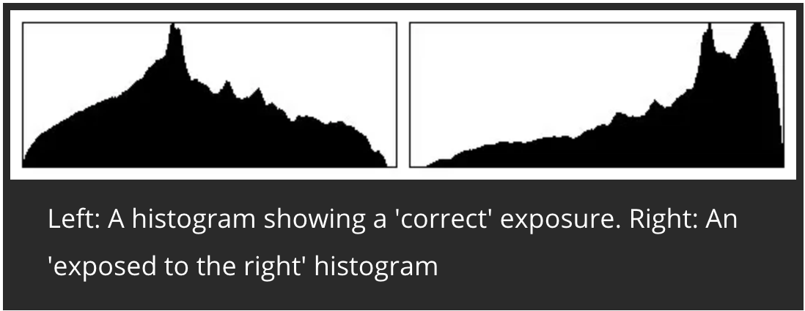
  - F-stops are logarithmic in nature meaning that each stop records half of the light of the previous one. Practically, this means that the brightest stop records half of the possible number of tones, i.e. 2048, the second stop records half again, i.e. 1024, and so on until the seventh stop that records only 32 tonal levels.
    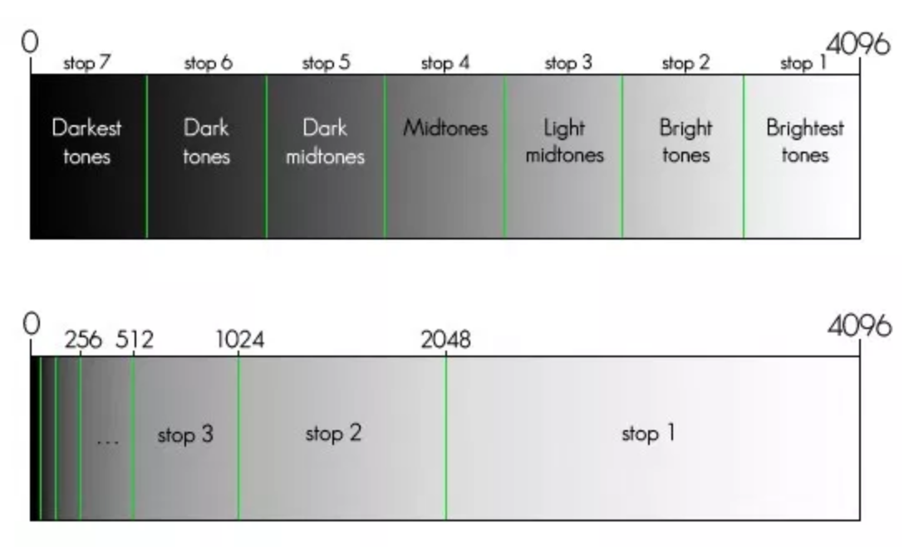
  - However some people (portrait photo guy) underexposes in order to protect the whites, since it is easier to recover the darks as the lights.
- **Light, weather, season**
  - "golden hours" = after sunrise / before sunset. The period may vary depending on how close you are to the poles.
  - "blue hours" = Before sunrise / after sunset. Early blue hour is just before the sun is set, and late blue hour is when everything is turning dark.
  - Sky is also very important -> In Rome you might have 30 full days of blue sky, which is boring.

### Lense stats

- **Canon EF 17-40mm f/4L USM mounted on Canon EOS 6D**
  - Measurements:
    - 17mm: 5.6 > 8 > 4 > 11 > 22 (Never use. Over 50% drop in sharpness)
    - 20mm: 5.6 > 8 > 11 > 4 > 22
    - 24mm: 5.6 > 8 > 11 > 4 > 22
    - 28mm: 5.6 > 8 > 11 > 4 > 22
    - 35mm: 11 > 5.6 > 8 > 4 > 22
      - 5.6 provides more center sharpness while 11 gives more overall in the corners
    - 40mm: 11 > 8 > 5.6 > 4 > 22
  - Usage:
    - Preferably use in the 17-24mm range with f 5.6
    - Never use it above 30mm nor with f 22!
    - Over 24mm switch to 24-105mm
- **Canon EF 24-105mm f/4L IS USM mounted on Canon EOS 6D**
  - Measurements:
    - 24mm: 4.5 > 4/5.6 > 8 > 11 > 22 (Never use. Over 50% drop in sharpness)
    - 35mm: 5.6 > 4 > 4.5 > 8 > 11 > 22
    - 50mm: 8 > 5.6 > 11 > 4 > 22
    - 75mm: 8 > 11 > 5.6 > 4 > 22
    - 85mm: 8 > 11 > 5.6 > 4/22
      - 4 more center sharpness 22 more overall
    - 105mm: 8 > 11 > 5.6 > 22 > 4
  - Usage:
    - Use in the 24-70mm range.
    - Avoid using it in the 70+ range especially with f4/f22.
- **Tamron SP 70-200mm F/2.8 Di VC USD Canon mounted on Canon EOS 6D**
  - Measurements:
    - 70mm: 4 > 2.8 > 5.6 > 8 > 11
    - 100mm: 4 > 5.6 > 2.8 > 8 > 11
    - 135mm: 5.6 > 4 > 8 > 2.8 > 11
    - 200mm: 5.6 > 8 > 4 > 11 > 2.8
  - Usage:
    - In the 70mm+ it outperforms the Canon 24-105mm.

### Photo shooting tips

- **Nd 0.9 -> 8x**
  - E.g.: 0.3sec -> 2.5 sec
- **ND 1.8 -> 64x**
  - E.g.: 0.1sec -> 6.4 sec
- **ND 0.6 -> 4x (drop in)**
  - E.g.: 0.2 -> 0.8 sec

### Photo shooting tips

- **General tips**
  - Make sure your tripod is set up correctly. ("Sturdy")
  - Level the tripod. Also use the in-camera level system.
  - Get there early and explore the location. Explore the angles and the compositions.
  - Compose the picture as much as you can. Look into the corners. Are there disturbances that you can avoid? -> Use the Ipad. Especially when shooting from a low angle you won't see much on the small screen.
  - Use AEB. (Exposure bracketing)
  - AWB is ok for 99% of the time. If you find it off, use manual kelvin temperature adjustment.
  - When working with filters note that autofocus won't work through the filter very well. Lock the focus on non-filter mode and then screw it on.
  - Crystal clear water reflections occur early mornings.
- **Composition**
  - **Foreground / Subject / Background!**
  - **Leading lines and paths**
    - Do you have **leading lines** in your picture? You can use these to lead the viewers attention to specific spots. It is important to _lead_ the attention somewhere! If you have strong leading lines (road/river/path in a forest) and these lead completely off the subject of your image they rather have a negative, disturbing effect.
      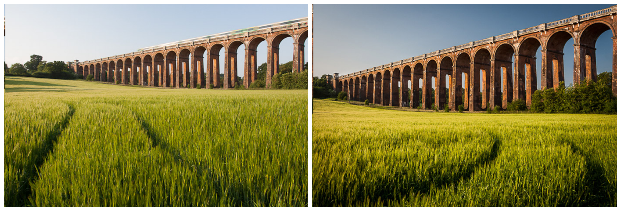
      - Avoid horizontal leading lines that "block" the view into the middle of the frame and cause the viewers attention to drift to the sides of the photo.
        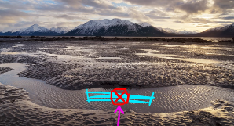
      - Avoid vertical lines as well. Have a vertical leading line on the right side of the image, and the viewer will completely disregard the left side of the image.
        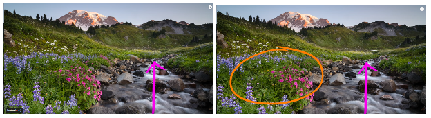
    - Do you have **vanishing points / paths**? These run through the frame and vanish into the distance. Can be a river or a road.
  - **Guide (Rule) of thirds**
    - Add interesting points to the horizontal lines, vertical lines and to the intersections points.
  - **Visual Weight**
    - Eyes
      - The first thing viewers see is the eyes. If the eyes of the subjects are looking away from the camera,this can be a great way of forcing the viewer to look at multiple parts of a photo in order.
    - Size, color, contrast
      - The more you zoom, the more the different objects will be "brought to the same pane" -> meaning that you can bring huge items seemingly closer to the subject in the background. The more wide angle you use, the more things will be spread out.
      - When you are shooting close with a wide angle lense you emphasize the main subject while pushing back and minimizing the rest of the image. (I.e. church in the front is big, mountains in the BG are tiny) <--------> (Big distance between subject and BG!)
      - When you go back and use a tele objective it will seem that the subject and the background (mountains) are in the same distance. <--> (Small distance between subject and BG)
    - Text and writings
    - Multiple points of interests (e.g. multiple persons etc.)
- **Panorama**
  - Make sure that the camera is leveled throughout the whole pano sequence
  - When shotting panorama level the tripod and **DO NOT USE AWB**, but set a custom color temperature.
  - Keep everything constant in manual mode, while shooting the photo
  - Have ca. 1/3 overlap between the panorama shots
  - Note that as you rotate things in the far "will move less" as the things closer to the lense. He uses a panorama gimbal & slider.
- **Long exposure**
  - If you want to go over 30 seconds you will need to use the Bulb mode and set the exposure time on your shutter release.
  - If you are near water using filters will collect even more water drops. Try to minimize the time and the amount of shots taken.
  - If the sky is changing very fast, you might want to stack ND+graduated in order to have "everything in one shot". (At 1-2 min exposure you don't have time for bracketing (\*3-5 times...))
  - Water shooting:
    - Lake: on long exposure shots there is a point where the water gets perfect (1min) after that (2-3min) it won't get any better, but will pick up more reflections from the sky.
    - Waterfall and splash: The waterfall will get "dreamy" after 4-8sec, but the water itself might get only "dreamy" around 30sec.
  - LOCK DOWN the color temperature when doing multiple shots (for Auto Bracketing, or manual merging)
  - When shooting long exposure don't forget to remove the hot pixels in after processing.
- **Focus stacking**
  - If you don't use wide angle (e.g. 30mm+) infinite focus will produce out of focus parts.
  - When you have multiple ND filters, go down to f4, pick the point you want to focus on, set the AF for this point, and then go back to f8/f11
  - Shoot images with different focuses
- **Shooting the sun**
  - Idea: Have a small sun without the massive rays and glare!
  - Using all **9** exposure brackets
  - Shoot 9 with the sun (creates lense flater), and 9 while covering the sun. No filter used as the more glass the sun hits the more flare it creates! (Remove the UV filter as well)
  - 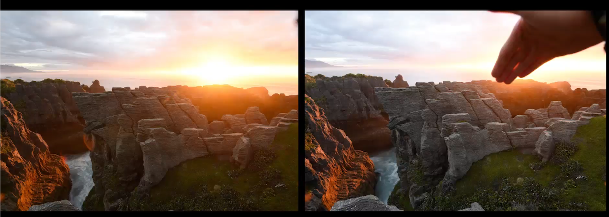
- **Car light trail shot - road shot**
  - Get the blue hour shot of the road
  - Wait a bit and take the trail shots with 20-30 second exposure. These 2 images will be blended later in PS.
- **Northen Light shot**
  - Unfortunately rare - sun activity has to be there, clear sky has to be there, new moon ("no moon") is also an advantage.
  - Here you will use higher ISOs -> 400+ (or even 1600/3200).
- **Shooting at common places**
  - Put your tripod away from rails. People will lean on it, and it might shake your tripod
  - Set up the tripod tight, so that you don't take up much space and people won't kick into it
- **Early morning shots**
  - You gotta get there in the dark - i.e. before the sun rises
  - Set up the camera the best you can and take 30s exposure pictures just to check your composition
- **Starburst of lights**
  - The smaller the aperture (the larger the f number) the more starburst you get from street lamps.
- **Astro photography**
  - ISO 1600-3200, F2.8 preferably. Wide angle (less than 24mm)
  - Turn off Vibration Reduction. Manual focus mode.
  - The five hundred rule
    - 500/mmIShoot = seconds to expose -> otherwise stars will move...
- **Other Tips**
  - If you have strong backlight disable the viewfinder so that no light goes into the camera that way!
  - Elia doesn't use polarizer in sunset/blue light images. Sometimes if shooting behind a glass maybe, but very rarely general.

### LightRoom tricks

- Light correction
  - Exposure, Highlights, Shadows, White, Black
  - Dehaze slider (bottom) is also very cool! (You can use it more agressively)
- Selective light correction
  - (With grad tool in LR?!) **TODO**
- Sharpening in Lightroom is not that good, turn down to 0. We will do it in PS
- Lense distortion (remove)
- Chromatic aberration (remove)
- Export with ProPhoto RGB, 16bit color depth
- Copy preset of an image by:
  - `Right click -> Develop Settings -> Copy Settings`
  - Select all the images, right click on the edited image -> sync settings.
- Use "Photo merge" to create panorama from multiple images (You can do this in PS as well)
- Press `J` to see clipped birhgt/dark areas
- CameraCalibration -> Change the profile from flat to camera neutral/landscape if your image is super flat.

### CaptureOne

- GUI Setup
  - View -> place tools to the right
- Capture One Strengths
  - Perfect for bringing back color to flat images
  - Does great sharpening by default
  - Clarity is also much better! (+5-10)
- Lense correction
  -Distortion, Sharpness falloff (only if wide angle shot), Light falloff to 100%
- At the levels tab of the Historgram panel you can clamp the lights/darks and even the mid-tones
- Sharpening and noise reduction left as it is
- Export
  - Right click on the image in the "image browser" -> export -> variant
  - Psd, 16bit, ICC ProPhoto color space or AdobeRGB, 300dpi, 100% scale, open with PS
  - You can also export as TIFF.
- Right click copy adjustments -> select all paste.
- You can select color ranges (on the circle color palette) and adjust the saturation/light per color

### AutoPano Giga

- Builds low res pano

### PS tricks

- **Color Fx Pro**
  - **ProContrast**
    - _Dramatic contrast_ which operates only on mid-tones. (can use 40-70%)
    - _Correct contrast_ (0-10%) to boost overall contrast.
  - **Brilliance/Warmth**
    - You can add 10-15% extra warmth, however you can do the same in Lightroom.
  - **Contrast / Color range**
    - Zero out the initial values
    - Color contrast to 50-60%
  - **Polarization**
    - Extra contrast to blue colors -> (sky/water etc.)
  - **Tonal contrast**
    - Play with the U-points when working with contrast in general.
    - `Opt+Drag` to duplicate an existing U-point
    - Go to the mask mode when dealing with U-points to see the U-point "effect area"
    - Usually apply little (7%), and also play with opacity
  - **Classical Soft Focus**
    - For "glowing" effect. No need to apply to whole image -> use a mask.
  - **Define**
    - To remove (ISO) noise from the image.
    - If auto mode doesn't works, then go to manual and select a noisy area and click measure. Create a mask for define and use it in the sky (this is where the noise is the most prevailent)
  - **White neutralizer**
    - If you see that a white balance is off for a specific color use this tool.
    - Pick up the color for which you want to reset the correct W/B
    - Adjust whole image 22% adjust whites 11% in this case, and using the control points lock in the effect for your object.
- **Perfect Photo Suite 9 (another propertiary tool)**
  - File -> Automate -> Perfect Effects 9
  - Using the purity you can remove saturation (and hence color cast) from highlights / shadows.
  - Try out, play around see if you like!
- **Sharpening**
  - **Normal (PS)**
    - Duplicate the original (image) layer
    - Filter -> Other -> High pass
    - ca 3-5px radius
    - Blending mode overlay on the sharpening image.
    - Play with the opacity if wanted.
  - **Selective (PS)**
    - Repeat steps from "normal".
    - Drag and drop the layer to the "mask" icon to create a mask from it.
    - Use the `/` key in the english keyboard to enable quick mask mode.
    - Use a brush (with flow 10-20%) to paint the parts you need sharp
    - Selective sharpening can be used with an inverted blue channel layer (if you don't want to apply it for the sky). Now to avoid "halos" around the edges, when sharpening do the following:
      - Select -> Modify -> Contract (2 pixels)
      - Select -> Modify -> Feather 1
  - **Nick sharpener pro**
    - You can use it additive to the normal sharpening
    - Output sharpening strength a bit down
    - Focus a bit up
- **Image position correction**
  - `Cmd+R` to show the ruler
  - `Cmd+T` to free transform.
  - (Not sure, but if you hold `Opt` and drag a corner you are "skewing" the image.)
- **Dust removal**
  - Selective healing brush with _content aware mode_ and _sample all layers_!
- **Dodge and Burn**
  - Hold `Opt` and click on the layer (pulls up new layer panel)
  - Add layer name and select _overlay_ mode, and set 50% neutral (creates a gray)
  - Use the brush and white/black colors to dodge/burn
  - Node that you can do this selectively on a specific color channel. E.g. You create a mask from the red channel, apply it to a mask, and then start to D&B inside it. (Sun is orange, casting red lights to clay rocks -> use red channel)
- **Merging two images with masking**
  - Paste the two images as two layers
  - Create a mask from the top image and use the brush tool to selectively apply the image as a mask.
- **Color contrast separation**
  - Idea: Enhance/Remove contrast based on color range. Adjust brightness on the whole image. Apply both of these adjustment layers via the same mask. Thus instead of dodge/burn with B/W we do this by dodge/burn with saturation and brightness
  - Bottom menu (Adjustment Layer) -> Hue/Saturation adjustment layer
  - Select blue and adjust the color range to select all shades of blue
  - 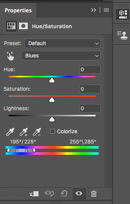
  - Using the saturation/lightness you can darken this specific color range!
  - Create a brightness/contrast layer, adjust these and then put this and the Hue/Sat layer into a folder.
  - Create a mask for the folder by selecting it and `Opt` clicking the mask. (Creating a black mask for the folder.)
  - Using the brush tool you create the "mask". (Use quick mask to see what you are doing)
  - _Play around with the brush strength to create "stripes" of different contrasts int the image_
- **Image overlay alignment**
  - Take the top layer and set the blending mode to "difference". Now you see the difference between the two layers. Move the top layer with the arrow keys until the "edges" disappear.
- **Luminosity mask for highlights replacement**
  - Hide the "sky" (top) layer, so that the foreground with the blown out sky is visible. You want to create the luminosity mask on the blown-out layer and apply it to the normal sky layer!
  - Select the channels panel
  - 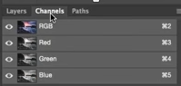
  - Select all the layers (RGB), `Cmd` click the RGB channel (hence creating a selection) and click the "Mask" icon in the bottom menu to create an "Aplha1" channel.
  - You can use `Cmd+I` on this alpha channel to have the highlights/shadows selected.
  - `Cmd+Click` on the alpha layer channel, go out to the "layers" panel, create a new folder and click on the mask icon in the bottom menu -> hence the alpha layer mask will be applied to the folder! -> and that's your luminosity mask!
  - Put in the image "dark sky" mage into the folder and create a mask with a gradient, so that the "Luminosity mask replacement" will be only applied to the top of the image
  - 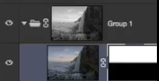
  - Using the brush tool mask out "non-sky" parts (additive to the gradient mask)
  - You can also clamp the highlights/shadows on the lumi-mask using the "curves" tool
- **Luminosity mask for color correction**
  - Imagine that you want to add more contrast or correct the colors only in the sky (i.e. bright areas), but you want to leave the shadows intact.
  - 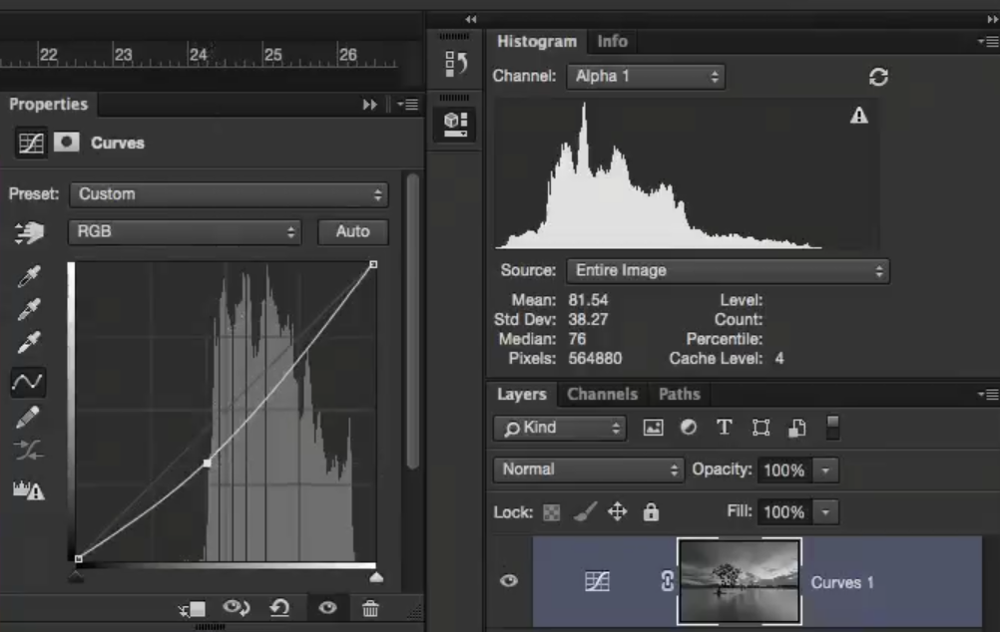
  - So basically if you do an "S" curve you are popping the lights and making darks darker (hece adding contrast), _but only to the dark/light areas depending on the alpha channel!!!_
  - Also you can use the curves specifically on blue/red/green layers. If you start clamping on the top (red channel) then your image will have a more purplish color. (You dont need alpha channel mask for this!)
    - Having the channel selected, simply hit `Cmd+M` for curves. Once clamped you can **still** select part of the channel (make a selectim) and do clamping on the selection even more!
      
  - Now you know how to create luminosity mask and it's inverse. (Select -> `Cmd +I`). However How do you create a layer for midtones? Having the highlight and its inverse channels do the following:
    - Select ALL on the highlights (`Cmd+A`)
    - Then `Cmd + Alt` click the highlights (itself) channel and then the shadows channel. (Warning appear -> OK.) Then click on the mask icon.
  - Finally clamping the R/G/B levels individually you can enhance / finetune the sky color.
- **Removing people and objects**
  - **Using clone stamp**
    - Create a new layer, select Clone stamp, set "Sample" (top menu row) to "Current & Below", "aligned" and now remove the people form the image.
    - You can also pick up any color and simply paint this color over the people and thus remove them.
  - **Median of multiple images**
    - Open PS (no image yet), -> Edit -> Scripts -> Statistics
    - Select `Median`, select the images you exported from lightroom
  - **Removal using vanishing point tool in scaled evironment**
    - Filter -> Vanishing point tool
    - Draw the perspective lines - i.e. rectangle. Try to be as precise as possible. Sometimes it is a bit buggy and the grid disappears.
    - 
    - Once drawn you can use the clone stamp, or use the selection tool, to select an area and `Opt` drag it. Doing so will duplicate the selection in a "magnified" way. (Aligned with the grid.)
    - 
    - Now you can apply a black mask on the new layer and mask out the parts you need from the scaled image.
  - **Removal aided with curves**
    - Create a new (empty) layer
    - Using the pen tool click at one point (this creating the starting point). Then click elsewhere **and hold** the mouse so that the line drawn between the two points will be bent proportionally to your mouse movement. (Bazie curves)
    - Then close the curve to form a shape and in the top menu click make selection. Add the feather and done.
    - 
    - Now with the selection on the empty layer and with the clone tool affecting current & below, you can start cloning recklessly as it will be only affected within the selection area.
    - Then you can invert, select the brush, hold `Opt` to pick up a color and then you can start painting color.
- **Sky replacement**
  - **Sample place multiple shots**
    - Basic idea: Have a sky selection from the "bad-sky" image. Create a mask from the selection and then the mask is applied to the "good-sky" image.
    - Select the image with the shitty sky as current layer
    - Select -> Color range
      - Change the fuzziness to have the sky selected. (ca. 110 fuzziness in this example)
      - In the color range settings window you can set "selection preview" to grayscale (at the bottom of the window) to see the "selection effect" on the full picture.
    - With the selection create a new folder
    - Click on the folder and create a mask form it (now the color-selection mask is applied to the folder)
    - Drag the good-sky image into the folder
    - `Option` - and click on the mask to see it full screen and using the brush B/W work on the edges! You want clear edges with the mask for the sky. Using the lasso tool select the rest of the place where the color selection should be black, `Shift+f5` and fill wih black! Thus you should end up with a nice (white) mask only for the sky.
    - Now it's time to free transform the sky that is in the mask (placement)
    - `Shift+Option+Cmd+E` -> to create a layer from the group.
  - **Sky from different image**
    - Closely match the sky on the other image (color tones).
    - On the original image copy the blue channel and clamp the B/W to have a clear line
    - 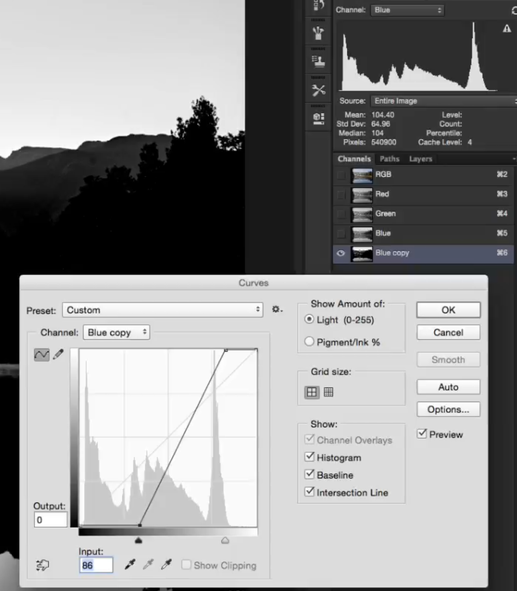
    - Notice that the water reflection doesn't look the same as the clamped sky. Select the water area (rectangular selection) and edit this area with the curves as well.
    - Create a new folder, apply the mask to the folder, and drag the "good sky" (different image) in this folder.
    - Cut out the image part (of the sky image) that you won't be using thus reduce file size.
    - Instead of **normal** mode use **overlay**
    - Copy the layer, turn it upside down, move it so that you have the water reflection as well.
    - If you have water you have to replace the sky's reflection in the water as well
- **Rebuilding warm tones on a washed out image**
  - **Curves**
    - Use the curves tool, but in the curves tool palette select the color channel-layers instead of the whole image. Hence the curves will be only applied to a specific color channel. Apply the curves on multiple channels to "mix the colors" and their effect.
    - Now you can apply a mask and brush in the parts where you want to use the color enhanced by the curves!
    - Don't overdo the colors. Sometimes only 5% is what you need!
  - **Photo filter**
    - Applies a specific color (e.g. orange) to the entire image
    - Also apply masks to these photo filter layers
  - **Vibrance layer**
    - 18-20%
    - Also use it with a mask.
  - **Manual (Brush)**
    - New Layer, Brush tool, pick a color (orange), set the brush f to something appropriate, set opacity of brush down and start painting light.
    - Opacity & Flow on 100%. Print an area.
    - Set the opacity down, print around the opa 100% area.
    - Set the opa down, print around again.
    - Finally set the blending mode to "Soft Light".
    - Filter -> Blur -> Gaussian blur to remove any wierd lines by the brush opacity
    - Finally play around with the layer's opacity.
  - **Adding fog**
    - Create a new black layer. (Press `D` to set color to black, press `Alt + Del` to fill the layer with black)
    - Filter -> Render -> Clouds.
    - Filter -> Convert for Smart Filters (so that we can edit values later)
    - Filter -> Blur -> Gaussian blur (8px or around)
    - Filter -> Blur -> Motion blur (2 angle, 20px distance)
    - Blending mode to "Screen"
    - `Cmd + T`, Right click -> Perspective. Change the perspective using the corners of the rectangle. (So that you align the fog with the lake or what so ever)
    - Create a black mask for the fog layer and print in gradually -> 1 line of bright white (opa 50%), around that less (double brush, 25% opa) and less (brush \*2, opa /2)!
    - To adjust the fog to the image's tone go into the "Color Balance Adjustment", lock in to current layer (see img) and adjust the colors.
    - 
  - **Selective color adjustment tool**
    - Also a cool stuff!
- **Focus stacking**
  - Sharp foreground on top of sharp background.
  - Take the sharp foreground image, create a mask and "mask out" the background part with a gradient overlay.
  - Fix the mask with the brush tool (flow 20%, opacity 100%)
- **Sunset photography**
  - Sky & Sun merging
    - Have 3 images. 1 (darkest) for the "spot" sun. This "flares", but the image is dark anyway. One that is the "most normal" (for foreground) and one between the two that will be used for merging. (Base layer for merging the other 2 layers.)
    - Dark image -> Channels -> create an alpha mask and apply it on a new folder. Throw the dark image into this folder-
    - Correct the mask with gradient, and bring back a portion of the old (light) sky back with 20% flow and ca 70% opacity.
    - Now we want a mask that focuses on the shadows. (**`Cmd` click the existing mask, create a folder and click "mask" -> creating a mask**)
    - Use the gradient (just like before), but in the different direction).
  - Flare reduction from foreground
    - Lastly we want to remove the flare. Since we shot 9 non-flare images as well we will find a very similar image wrt tonality. Put this image on top, apply gradient.
- **Adding artificial light**
  - Put the light (car trail) image to the top, and apply blending mode `Light` so that only the light parts of this image are overlaid.
- **Correcting vertical (and horizontal) distortion due to ultra wide angle lense**
  - Distortion might occur because you have your lense tilted. (Tilted down/up)
  - If you have sea or some reference where you know it is "horizontal" pull down a liner
  - Select **all** layers and hit `Cmd+T`
  - Hold the `Cmd` to skew the image. If you hold `Shft+Option` changes will be mirrored on both sides.
  - `Cmd+,` to hide the guides, `Cmd+R` to hide the rulers
- **Removing blue color wash**
  - Hue/saturation mask (or correction)
  - Pull down the saturation but specifically for the blue channel. Also you can mask it afterwards.
  - Lightness up/down, Saturation down (play around and see for the image...)
- **Correct image exposure**
  - Add the curves, and clamp the highs / lows. If you have highlights that get burnt, use a mask!
- **Blending blue hour city light into sunset image**
  - Basic
    - Blending mode -> "Lighting" and then correct the rest of the image via masking. (Black mask, "paint in the light")
    - At the edges use the lasso tool to be precise!
    - Select the mask and add some feathering in the mask settings to avoid sharp light/dark transitions.
  - Advanced
    - First reduce the burn-out from the light sources.
      - This is done by having a darker image with less burned out light sources. You use this image as an overlay with two masks:
        - Luminosity mask on the folder
        - Mask in the individual light sources with the brush tool. Don't forget the water reflections as well.
          
      - Second you overlay the blue hour (city-light) shot and blend it.
        - For the blend you can go back to Lightroom, Burn out the sky completely. Then bring this image to PS and you can create an even better luminosity mask focusing entirely on the city buildings that will be layed over. Additionally use Brush with 100% flow to have the outline of the city. Once the mask created you can throw out the layer.
        - **Don't forget to apply a 0.2px feather on the mask!**
          
        - Some elements as trees move between the sunset and the blue hour, thus we "blend out" these elements using a mask and a brush.
          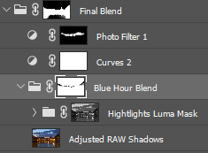
        - Finally you can use a "photo filter" with the orange color (warming filter) and mask in the orange to the missing places.
- **Hotkeys**
  - `Shift` key on a mask to turn it on/off
  - `Cmd+J` to duplicate layer
  - To edit an already existing gradient layer
    - Unlink the gradient mask, select the mask, hit `Cmd+T` and transform. Don't forget to re-link!

### Iceland - Seljalandsfoss

#### Photo

- White balance bracketing
- And one with long exposure for the waterfall

#### Post processing

- **Lightroom**

  - Same as usual, basic shadows/highlights/B&W correction

- **Photoshop**

  - Paste the two images (light & dark on the same workspace)
  - Above your "layers list" you have "layers, channels, paths". Click channels to see the separate color channels.
    - If you `Cmd` click any of the channels it will be taken as a selection. Having the selection create a new mask. -> "Alpha 1". I.e. we created a luminance selection!
    - Go back to the layers (with your alpha selection ON)
    - Create a new folder and click new mask.
    - Finally drag the "dark sky image" into this folder.
    - (At this point you have a folder that is linked to the Alpha channel's mask, and you have the sky image sitting in the folder.)
    - Select the image that you put into the folder and create a new mask. (This will be a white image next to the original image)
    - On the white image (mask) add a gradient -> now you have the dark sky from the original image "masked into with a gradient" to the foreground image
    - Add the finishing touches with the brush. Idk why this approach is better than the other
  - Mask in the waterfall from the long expo
  - New layer -> remove the guy with clone stamp
  - `Opt` click on a mask to see ONLY the mask!
  - Now you can clamp the whites on the alpha channel mask using the histogram tool.
  - Put the layers into a folder and create a layer from the folder content.
  - ColorFxPro - usual stuff...
    - To protect the highlights from the effect, you can use the highlights slider in pro contrast.
    - Contrast color range = add **only** dynamic contrast
  - **New**
    - Start using the historgram to clamp different color layers!
