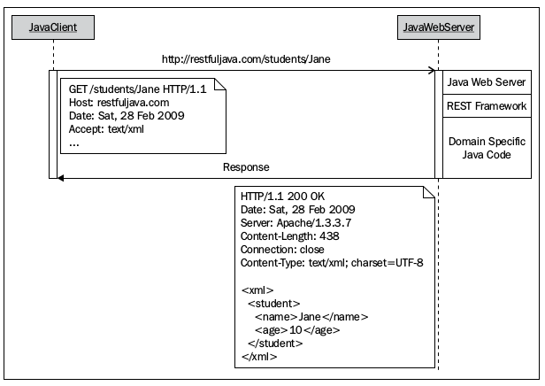

# Restful Java

## RESTful Architectures
- **REST = REpresentational State Transfer**
- A RESTful system is:
  - It must be a client-server system
  - It has to be stateless — there should be no need for the service to keep users' sessions; in other words, each request should be independent of others.
  - It has to support a caching system — the network infrastructure should support cache at different levels
  - It has to be uniformly accessible — each resource must have a unique address and a valid point of access
  - It has to be layered — it must support scalability
  - It should provide code on demand — although this is an optional constraint, applications can be extendable at runtime by allowing the downloading of code on demand, for example, Java Applets.
- Resources in REST: A RESTful resource is anything that is addressable over the Web. By addressable,
we mean resources that can be accessed and transferred between clients and servers.
- Representation: A representation is a temporal state of the actual data located in some storage
device at the time of a request. A representation can take various forms, such as an image, a text
file, or an XML stream or a JSON stream, but has to be available through the same URI.
- URI (Uniform Resource Identifier): in a RESTful web service is a hyperlink to a resource, and it's the only means for clients and servers to exchange representations.
- **CRUD** (Create, Retrieve, Update, Delete) mapped to HTTP Post, Get, Put, Delete.
  - --> In their simplest form, RESTful web services are networked applications that **manipulate the state of resources**.
- **GET/Retrieve**
  - Only use get to fetch/get data!
  - Assume that we have a Students (with unique name, age and URI (link) properties)
  - A request to retrieve a Jane resource uses the GET method with the URI `http://restfuljava.com/students/Jane`

    

    - A Java client makes an HTTP request with the method type GET and Jane as the identifier for the student.
    - The client sets the representation type it can handle through the `Accept` request header field.
    - The web server receives and interprets the GET request to be a retrieve action. At this point, the web server passes control to the RESTful framework to handle the request. Note that RESTful frameworks don't automatically retrieve resources, as that's not their job.
    - The server-side program looks for the Jane resource. Finding the resource could mean looking for it in a database, a filesystem, or a call to a different web service.
    - Once the program finds Jane , it converts the binary data of the resource to the client's requested representation.
    - With the representation converted to XML, the server sends back an HTTP response with a numeric code of 200 together with the XML representation as the payload.

- **POST/CREATE**
  - Used to create data.
  - In this scenario the clients sends the text/XML data, the web-sever forwards the request to the REST fw. The REST fw. stores the data and returns a status code and/or message with a type accepted by the client.

- **PUT/UPDATE**
  - Similar process - sending data, however REST fw. updates nstead of creating.

- **DELETE/DELETE**
  - Similar process, but REST fw. deletes the entry.

## Java APIs for JSON Processing
- XML and JSON are the two most popular formats used by RESTful web services today.
- JSON:
  - objects are represented in the attribute-value pair format
  - JSON can be:
    - **unordered** collection of name-value pairs (representing an object). The name and the value in a pair is separated by a colon ( : ) Each name:value pair in a JSON object is separated by a comma ( , ). The entire object is enclosed in curly braces ( { } ).
    - **ordered** collection of values (representing an array): Arrays are enclosed in square brackets ( [ ] ), and their values are separated by a comma ( , ).
  - Datatypes:
    - Number {"totalWeight": 123.456}
    - String {"firstName": "Jobinesh"}
    - Boolean {"isValidEntry": true}
    - Array {"fruits": ["apple", "banana", "orange"]}
    - Object {"departmentId":10, "departmentName":"IT", "manager":"John Chen"}
    - null {"error":null}
  - Processing JSON:
    - **Object model:** Entire JSOn is read into memory and parsed.
    - **Streaming model:** It reads one element at a time. The most important point is that instead of letting the parser push the content to the client (push parser), the client can pull the information from the parser as it needs (pull parser). n this model, the client is allowed to skip or stop reading contents in the middle of the process if it has finished reading the desired elements.
      - Consider this when dealing with huge files.
      - 
